# Note 240726
## 动态 sql
- Link : `https://mybatis.org/mybatis-3/zh_CN/dynamic-sql.html`
- 注意 : Dao层 无论是 一个或多个参数 , 都要加 @param 否则 无法识别 , 会报错
- 多分支语句
  - 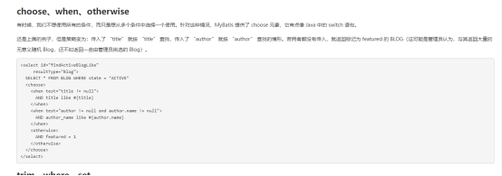
  - 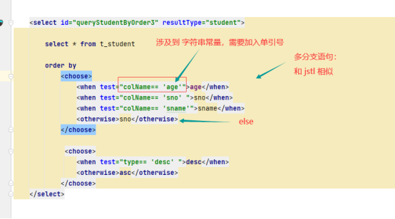
  - 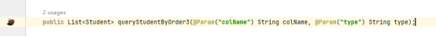
  - 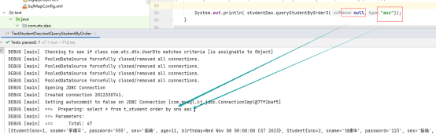
- where 的运用
  - 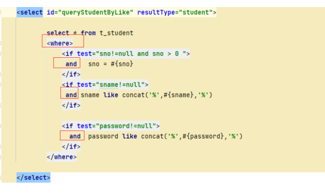
- Trim 的运用 
  - 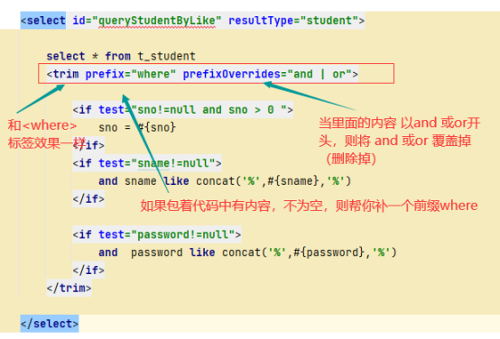
  - 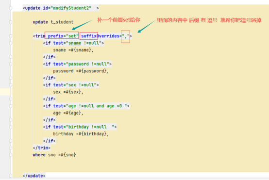
- set 的运用
  - 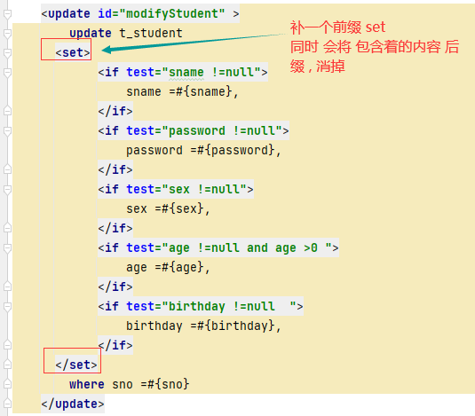
  - 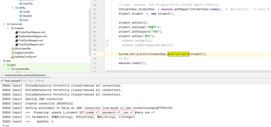
- foreach 的运用
  - 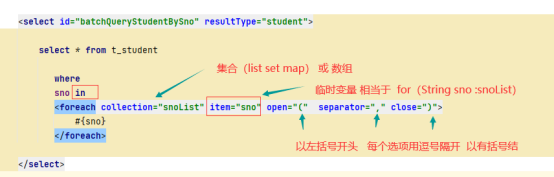
  - 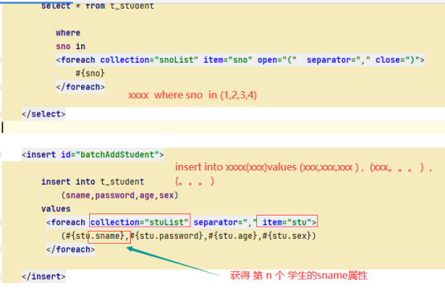
  - 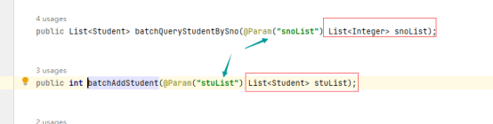
  - 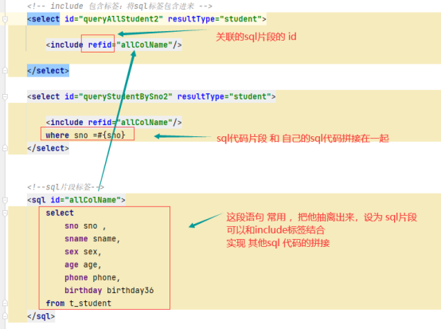
  - 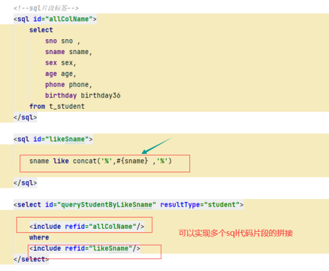

## 报错处理
- 用 动态 sql 时需要注意 :  Dao层 无论是 一个或多个参数 , 都要加 @param 否则 无法识别 , 会报错
- MyBatis 从 某 版本 开始 ， 可以 使用 ${} 形式 来 接受 参数 ， 而 不 需要 使用 @Param 注解 。
  - 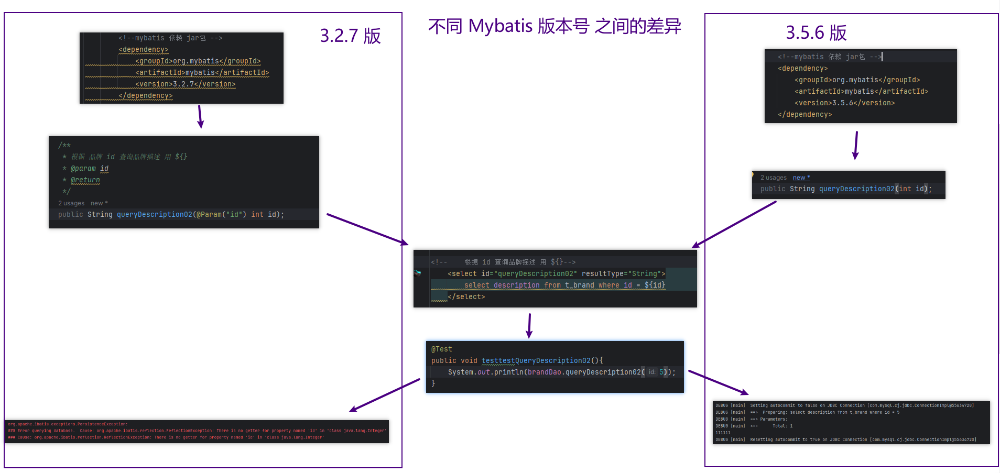