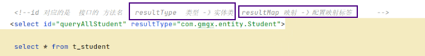
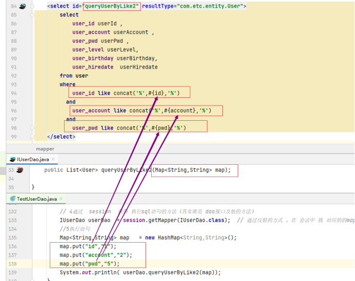

# Note 240724
## Review

## 池
- 常量池
- 数据库连接池
  - 使用连接池可以有效地管理数据库连接，避免频繁地创建和销毁连接，从而提高效率并减少对数据库服务器的负载。
  - `````
    链接对象 得到了充分的利用
    当没有链接的时候，五个链接对象 处于闲置状态
    当有人链接的时候，从这五个中随机分配一个给他当不用的时候，直接断开连接，其他人要链接的时候，又可以把它分配给这个人
    当请求连接高峰期，连接池 自然会扩容(产生更多的链接对象供我们使用)，高峰期过了，就会销毁多余的对象
    
## ...Mapper.xml
- ### resultType 和 resultMap 的区别
  -  
  - 返回类型 是 四类八种 + String 可以不用写 resultType
- ### 数据库表中的字段和实体类的属性名不一致
  1. 给 列 取別名
  2. 使用 ResultMap 映射
  3. 使用 @Result 注解
  4. 使用自动映射和命名规则
- ### 插入数据时 , 获得自动增长的值
  - ````
    useGeneratedKeys="true"  配置 一个 使用 （数据库的）自动增长策略
    keyProperty="sno"  用于指定一个 Java 对象的属性名，这个属性将会被赋值为生成的主键值。
    keyColumn="sno"    用于指定数据库表中生成的主键列名。
    目的是 告诉 mybatis 我们自动增长的那个key 是 哪一个属性以及哪一个列
    注意：插入语句的时候，就不用再写 sno 值

## 单元测试
- 测试中的类似过滤器的功能
  - @Before 在 @Test 之前执行
  - @After 在 @Test 之后执行

## 数据库 做 增删改 
- `.xml` 文件中 
  - `< 操作标签 >` 里不用写 paramType 
    - 在 MyBatis 中进行增删改操作时，通常不需要显式指定参数类型，而是通过以下几种方式来处理参数：
      1. 单个参数
         - 如果操作只涉及一个参数，可以直接在方法签名中定义该参数，MyBatis 会根据参数的类型来推断和映射参数。
      2. 多个参数
         - 如果操作涉及多个参数，可以使用 @Param 注解 在 `Dao层接口` 为每个参数命名，以便在 SQL 语句中引用。
           - 如: `void updateUser(@Param("userId") int userId, @Param("email") String email);`
         - 使用传对象的方式
         - 使用 Map 方式
           - 
         - 不推荐:
           - 直接使用#{0}#{1}#{2}或 #{param1}#{param2}#{param3} 的方式获得 第1 2 3 个参数 但不直观，容易写错
  
  - `< 操作标签 >` 里不用写 resultType
    -  MyBatis 中进行增删改操作（INSERT、UPDATE、DELETE），通常不需要写 resultType 是因为这些操作通常不返回查询结果集，而是返回操作影响的行数或者其他指示操作成功与否的结果。因此，不需要指定返回结果的类型。
  - sql 语句 where 那里 不用 #{实体类.属性} 直接 #{属性}
- 单元测试中
  - 一定要 `session.commit()` 目的是将数据写入 硬盘 中 , 否则只是做了操作 但是没写入硬盘 , 会报错


## log4j
- Log4j 允许开发人员在应用程序中插入日志语句，用来记录各种事件、状态或者错误信息
- 使用场景：

  - 开发调试: 在开发阶段，通过输出 DEBUG 级别的日志信息，帮助开发人员追踪代码执行路径、变量值等，快速定位问题。

  - 生产环境监控: 在生产环境中，输出 INFO、WARN、ERROR 等级别的日志信息，用于实时监控应用程序的运行状态和异常情况。

  - 故障分析: 当应用程序发生异常或者错误时，通过详细的 ERROR 或 FATAL 级别的日志信息，帮助运维人员快速定位并解决问题。


## 报错处理
- 当数据库表中的字段名称与数据库关键字相同或者与MyBatis的保留关键字（如id、resultMap等）冲突时，可以通过以下几种方式来处理：
  1. 使用别名（推荐）
     - 在SQL语句中为字段添加别名，以避免与关键字冲突。
  2. 使用反引号（`）转义
     - 可以使用数据库支持的反引号来转义字段名 
- 不能在 标签中 使用 -- 这种 sql 的注释方式 , 会报错(因为: Mybatis 不认这种注释方式 出现 #{} 也会识别到)