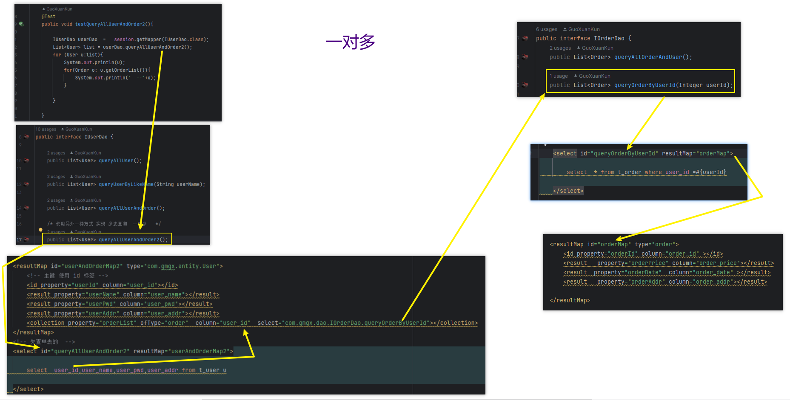
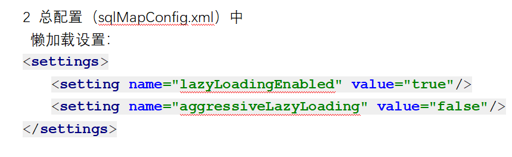

# Note 240729
## Review 

### resultMap
- ````
    1. resultMap

    resultMap 是 MyBatis 的一个重要元素，用于指定 SQL 查询结果如何映射到 Java 对象。它允许你定义复杂的对象映射，包括一对多、多对多的关系。
    主要属性及其意义：

    id:
        意义：唯一标识 resultMap 的标识符。
        用途：在其他映射中引用该 resultMap。

    type:
        意义：指定 resultMap 映射的 Java 类类型。
        用途：告诉 MyBatis 结果映射到哪个类型的对象。
  
    子元素：

    <id>:
        意义：指定映射对象的主键字段。
        用途：用于唯一标识对象的字段。
        属性：
            property：映射到 Java 对象的属性名。
            column：数据库列名。

    <result>:
        意义：指定其他字段的映射。
        用途：将 SQL 查询结果中的字段映射到 Java 对象的属性。
        属性：
            property：映射到 Java 对象的属性名。
            column：数据库列名。
            javaType：可选，指定 Java 类型（用于自定义类型）。

    <association>:
        意义：用于映射嵌套的对象。
        用途：处理一对一关系。
        常见属性:

            property:
                类型: String
                描述: 指定要映射到 Java 对象的属性名。例如，如果你的 Java 对象中有一个 profile 属性，你会在 <association> 中将 property 设置为 "profile"。它定义了在结果映射中要设置的 Java 对象的属性。
        
            javaType:
                类型: String (类的全限定名)
                描述: 指定与该属性相关的 Java 类型。这是一个可选属性，但在处理复杂对象时通常需要指定它，以确保 MyBatis 知道该属性应被映射到哪个 Java 类型。
        
            select:
                类型: String (SQL 语句的 ID)
                描述: 如果需要使用一个独立的 SQL 查询来填充关联对象，可以使用 select 属性来指定 SQL 语句的 ID。这个 ID 应该指向一个映射器 XML 文件中的 select 语句。
        
            column:
                类型: String
                描述: 指定从结果集中获取的列名。如果这个属性是复杂的对象的某个字段，你可以指定 column 属性来明确从数据库中哪个列填充这个字段。
        
            select:
                类型: String
                描述: 指定一个 SQL 查询的 ID，该查询用于填充该属性。这使得你可以分开处理复杂对象的查询和结果映射，提高灵活性和可维护性。
        
            resultMap:
                类型: String
                描述: 指定一个结果映射 ID，如果复杂属性本身也需要映射，可以通过 resultMap 来定义如何映射该复杂属性。

    <collection>:
        意义：用于映射集合属性。
        用途：处理一对多关系。
        常见属性

            property:
                类型: String
                描述: 指定要映射到 Java 对象中的集合属性的名称。例如，如果你的 Java 对象中有一个 orders 属性，它是一个 List<Order>，则 property 应设置为 "orders"。
        
            javaType:
                类型: String (类的全限定名)
                描述: 指定集合属性的 Java 类型。如果集合的元素类型较为复杂或非标准类型，则需要明确指定。通常，MyBatis 能够自动推断集合类型，但在某些情况下显式指定可以提高准确性。
        
            select:
                类型: String (SQL 语句的 ID)
                描述: 指定一个 SQL 查询的 ID，该查询用于填充集合。这个查询应该返回与集合元素相对应的结果集。select 属性的值是一个引用，指向一个 <select> 元素的 ID，通常在同一个映射器文件中定义。
        
            resultMap:
                类型: String
                描述: 指定一个结果映射 ID，用于映射集合中的元素。通过 resultMap 属性，你可以定义如何将查询结果映射到集合的元素上，这在处理复杂对象时尤其有用。
        
            ofType:
                类型: String (类的全限定名)
                描述: 指定集合中元素的类型。如果 javaType 是一个集合类型，如 List，则 ofType 用于指定集合中的元素类型。这样，MyBatis 可以知道如何将查询结果转换为正确的集合元素类型。

### resultMap 的 collection
- ``````
    collection 元素用于在 resultMap 中定义如何映射集合属性。它通常用于处理一对多关系，将 SQL 查询结果中的多个记录映射到 Java 对象的集合属性中。
    主要属性及其意义：

    property:
        意义：Java 对象中集合属性的名称。
        用途：指定要映射的集合属性。

    ofType:
        意义：集合元素的类型。
        用途：指定集合中元素的 Java 类，用于告诉 MyBatis 如何将查询结果中的每一项映射为该类型的对象。

    resultMap:
        意义：指定一个 resultMap，用于定义如何将集合中的每个元素映射到相应的 Java 对象。
        用途：指定一个 resultMap，用于定义如何处理集合中的每个项，以便将 SQL 查询结果中的每个记录映射为集合元素。

### 动态 sql
- `<标签>` 要做逻辑运算 用 `and` `or`

### 懒加载 ( 面试 工程量大时 常用 )
- 一对一
  - 
  - 
- 一对多
  - 
- 懒加载 总配置 放在哪里
  - 总配置的 配置顺序
    - 
  - 加配置
    - 
- 依赖 
  - 
- 三档 懒加载
  - 
  - 
  - 


