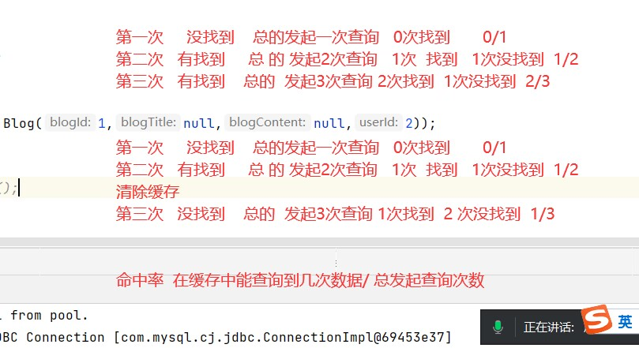

# Note 240730
## Review

### CGLIB
- ````
    CGLIB（Code Generation Library）是一个功能强大的 Java 库，用于动态生成和操作 Java 字节码。它的主要用途包括创建代理对象、动态扩展类和生成新的类，这些功能在很多 Java 框架和工具中都很重要，特别是在需要运行时生成或修改类的场景中。
        主要功能
        
            动态代理：CGLIB 可以动态生成一个类的子类，并拦截对该子类方法的调用，从而实现类似于 Java 的 JDK 动态代理的功能。与 JDK 动态代理不同，CGLIB 是基于子类生成的，因此它不需要实现接口。
        
            字节码生成：CGLIB 能够在运行时动态生成 Java 字节码，这对于需要在运行时创建新的类或修改现有类的场景非常有用。
        
            拦截器机制：CGLIB 提供了一种拦截器机制，可以拦截对目标类的方法调用，进行日志记录、事务处理、权限检查等操作。
    
        典型应用场景
        
            Spring 框架：Spring 使用 CGLIB 来生成代理对象，特别是在需要对非接口类进行代理时。Spring 的事务管理和 AOP（面向切面编程）功能经常使用 CGLIB 来创建代理对象。
        
            Hibernate：Hibernate 也使用 CGLIB 来实现延迟加载和代理实体类的功能。
        
            其他中间件：许多其他 Java 中间件和框架也会使用 CGLIB 来生成代理和扩展类。
  
### 缓存
- 一级缓存(session) 开启和关闭
  - 默认一级缓存（SESSION  会话级别） 是 开启的       STATEMENT 关闭缓存（执行级别的  每次都需要 重新 执行查询）
  - 
  - 
  - ````
     默认开启一级缓存  会话 session级别
     在同一个 session 对象，产生 同一个 dao对象，执行两次同一个方法（查询全部） ，第一次 会从数据库获取，第二次 直接从缓存中获取数据
     不同的 session 对象（s1 和 s2），产生 产生2个 dao对象（同类型 IBlogDao），分别执相同的方法（查询全部），
     这种情况下，不会用到缓存  （一级缓存是session级别，不同的session对象不会共享缓存）
     
    
     同一个session对象，产生的两个 相同类型的dao对象，执行相同方法，也是会用到缓存数据
     一级缓存，就是session级别，也就是同一个session会共享数据（前提是在相同dao类型执行相同方法）
     
    
     同一个的session，同一个dao对象，执行的不同的方法，但是查询数据一样（sql语句是一样的），这种情况下，
     不会用到缓存（  mybatis 只认准 类 和 方法  ）
     
    
     同一个的session 同一个dao对象，同一个方法，相同的参数 ，也是会有用到 缓存
     参数不同值， 肯定会再查一次（执行一次查询）
     
    
     特殊情况：不建议写的（涉及到魔术代码 把最终参数 或 数据 写死了）
     同一个的session 同一个dao对象，
     同一个方法，参数不同值， 但是 我们把sql语句写死了， 最终的sql语句（即将要传到数据库去执行语句） 一样的，mybatis会去判断，有没有必要再查一次,会缓存拿
  - 实现手动清除缓存
    - session.clearCache();
  - 被动清除  同一个session 中途 实现 增删改 操作 , 即使 我们查到的数据 和改的数据不是同一个数据，都会清空（实际上，是只要有增删改，整个 session 的缓存 都会清空掉）
    - 只要是 同一个session，无论是 增删改 任何的表（只要是增删改动作），session缓存都会清空
  - `````` 
    不同的session，就不会引起清除：
        s1 查询
        s2 增删改
        s1 再查询（旧数据，没有从数据库中获取新数据，而是从缓存中获得的旧数据 ：这种数据我们称为 脏数据 ）   
- 二级缓存
  - 
  - ``````
    步骤:
     1 在对应的 ...Mapper.xml 配置 及 缓存 标签  <cache></cache> 表示 当前的mapper开启了二级缓存
     2 对应的存放数据的对象，必须序列化  implements Serializable  , 使它的对象才能被序列化。
     3 一个 session 执行查询后，必须 关闭后，缓存数据才会保存到二级缓存中
     4 如果没有关闭，怎么查询都会不会通过二级缓存（命中率为0），所以一定要关闭才能保存到二级缓存
  - Cache Hit Ratio 的计算
    - 
    - 
    - 