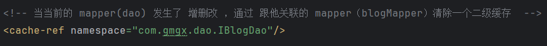
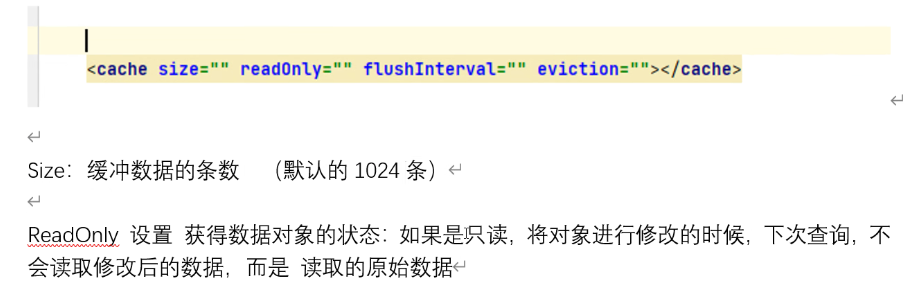
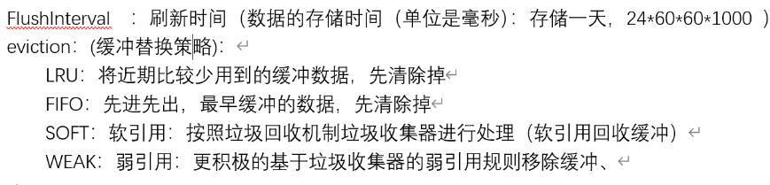
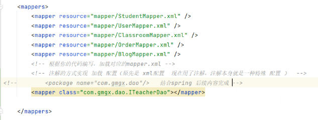
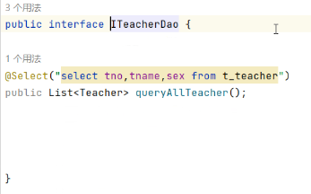
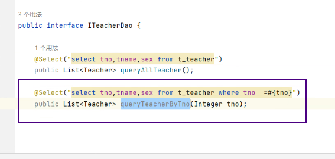
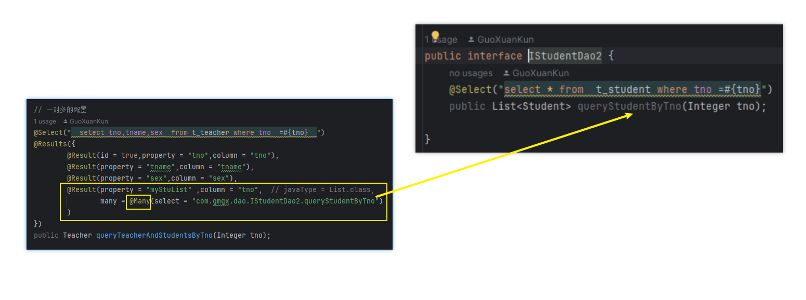
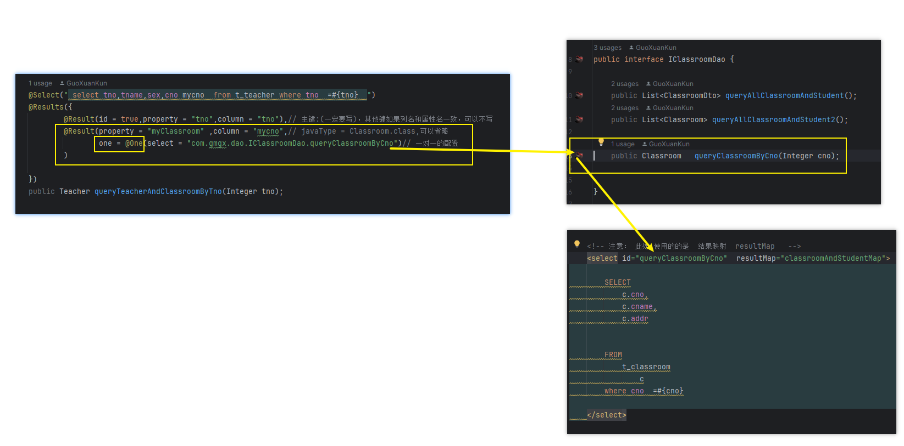

# Note 240731
## Review 

### 二级缓存关联关系
- ``````
  1 blogMapper 查询 ，然后，涉及到 user数据
  2 userMapper 增删改 ，他们是不同的mapper，所以 不用让blogMaper的二级缓存 清空
  3 blogMapper再次查询的时候，得到的是“脏数据" user 的数据 是旧的,
  4 解决方案：在UserMapper配置一个 缓存关联关系
  5 当然，配置完二级缓存关联关系后，就可以解决这个问题了
  
- `cache-ref`
  - 
- 二级缓存限制
  - 
  - 

### 使用注解实现 Mybatis
- ````````
  1 创建一个接口（ITeacherDao）
  2 在接口中写抽象方法（比如查询
  3 在方法上面写注解（@Select("sql语句")） 注意，这个sql语句和mapper中的sql语句一样（包括传参数方式）
  4 在sqlMapConfig.xml 添加 加载（注意 <mapper class="com.gmgx.dao.ITeacherDao"></mapper> 这里是引入 class ）
  5 测试：和普通写法测试一样
  
- 总配置(SqlMapConfig.xml) 加映射
  -  
- 不带条件的查询
  - 
- 带条件的查询
  - 
- 一对多
  - 
- 一对一
  - 
- 使用  注解版本的配置 一对多 和  一对一
  - ````
    1 使用 有 mybatis维护的 关联关系（一个主（表）查询  配合 另外一个 方法 从（表）查询  ）
    2 配置 @Results 相对繁琐一些 ，注意 引号 逗号 括号 等等 以及 是否写错单词。。。
    3 一对多 @Many  一对一  @One
    4 缺点：每个方法对应一个结果映射， 结果映射 不能被复用 ，所以 因为 列名和属性名不一致，建议使用 别名的方式
    5 缺点：写动态sql语句 或复杂的查询 ，需要注意 各种 引号 和 + 配合使用（把他当做 字符串 但是又要注意格式）
  