#  Note 240725

## 类和类的三种关系
- 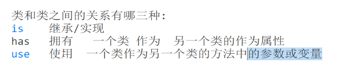
- is 继承/实现
- has 拥有 一个类 作为 另一个类作为属性
- use 使用 一个类作为另一个类的方法中的参数或者变量

## ...Mapper.xml
- SQL 执行 不要 出现大于号小于号 用转义字符
- Map 映射
  - 如果 mapper 中多处出现要写别名的情况下,resultMap也是可以起到一劳永逸的效果
  - 使用 关联关系
    - 类和之间的关系:
      - is 继承/实现
      - has 拥有 一个类 作为 另一个类作为属性
      - use 使用 一个类作为另一个类的方法中的参数或者变量
    - 一对一
      - 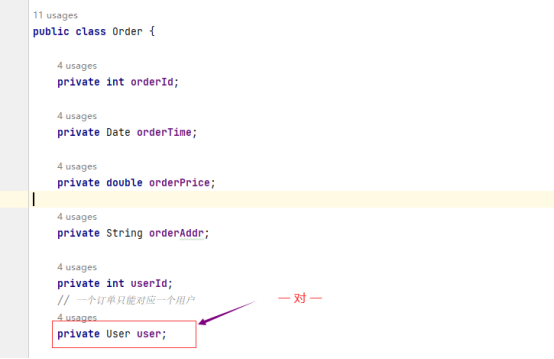
      - 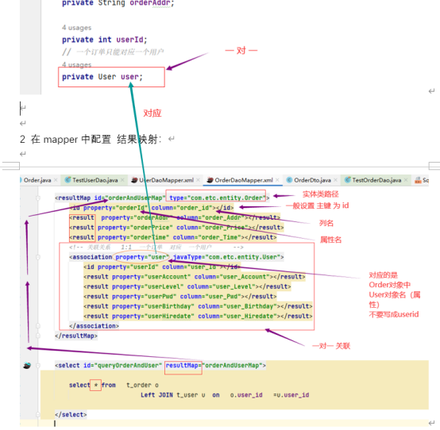
      - 执行
        - 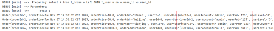
    - 一对多
      - 方案一 (不是 map 是 dto)
        - 创建一个专属的 Dto 类 配置上相应的属性
          - 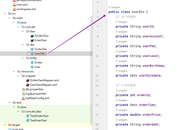
          - 在 dao层和 Mapper 直接使用
            - 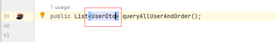
            - 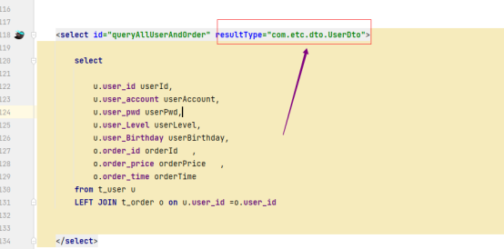
            - 缺点:没有帮我们整合成 1:多 效果 , 而是 全部列出来，相同用户信息出现多次
              - 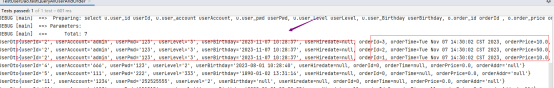
      - 方案二 使用 1对多 关系 (Map 映射)
        - 实体类 
          - 
        - ...Mapper.xml (映射文件)
          - 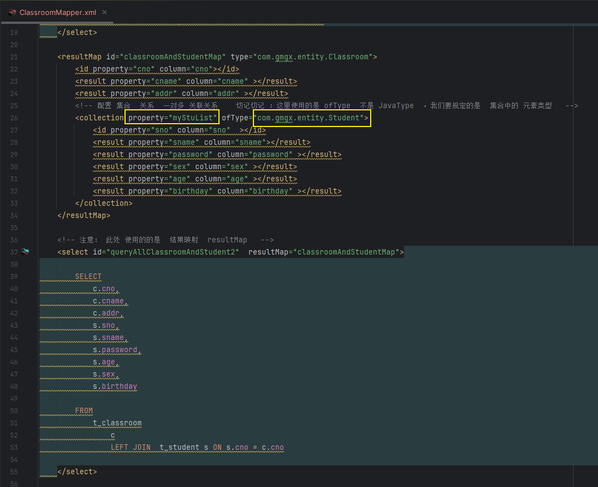

### 别名
- 在 SqlMapConfig.xml 中配置
  - 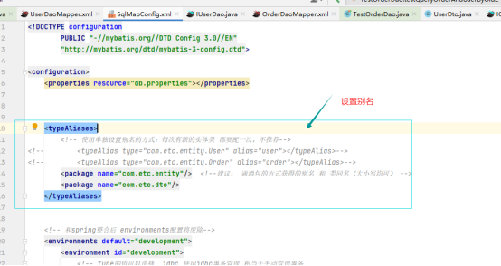
- 未使用别名 , 需要写全路径
  - 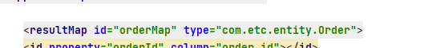
- 使用别名后 , 代码少很多
  - 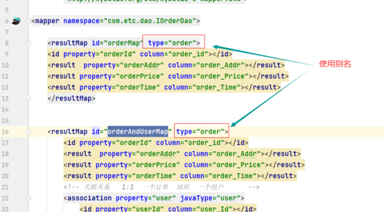
  - 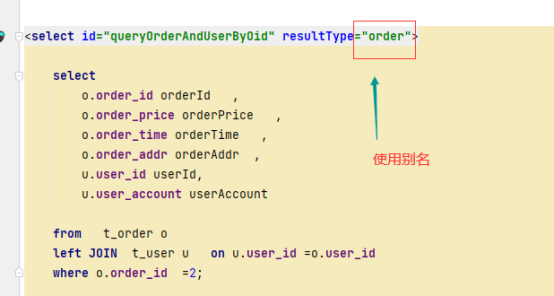