# Note 240808

## Review

- el 表达式 有就添加没有 就去除
    - 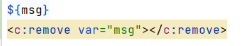
- SpringMVC 流程图
    - 前端控制器
        - /
            - 路径都会经过他
        - 获得请求路径
        - 类似 过滤器
    - 视图解析器
        - 
    - 核心
        - 

## SSM

### log4j.properties

- 日志文件 的 地址 以及 超过指定大小 后进行备份
    - 
- 最大备份数量
    - 
    - .1是下标
        - 

### applicationContext.xml

- 除了 controller 其他都经过这
    - 

### springmvc-servlet.xml

- 跟视图解析器有关
- 控制 controller
    - 

### web.xml

- 跟前端控制器有关
- 这段配置代码的主要作用是设置和初始化 Spring 应用上下文。通过 ContextLoaderListener 监听器，Spring 可以在 web
  应用程序启动时自动加载配置文件并初始化应用上下文。contextConfigLocation 参数指定了 Spring 配置文件的位置，确保 Spring
  能找到并加载这些配置。
    - 
    - 

### Spring 和 Mybatis 需要整合

- 

### sqlMapConfig.xml

- 设置别名
    - 
- 再到 applicationContext.xml 进行配置
    - 

## 代理

## AOP

- 步骤
    - 依赖
        - 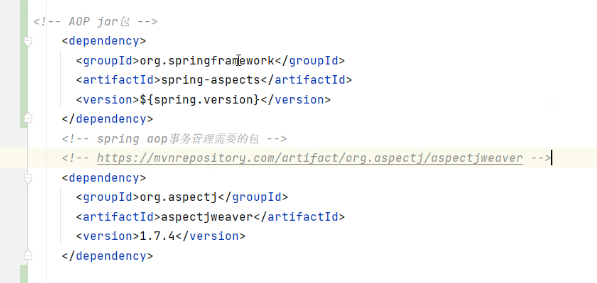
    - 写类
        - 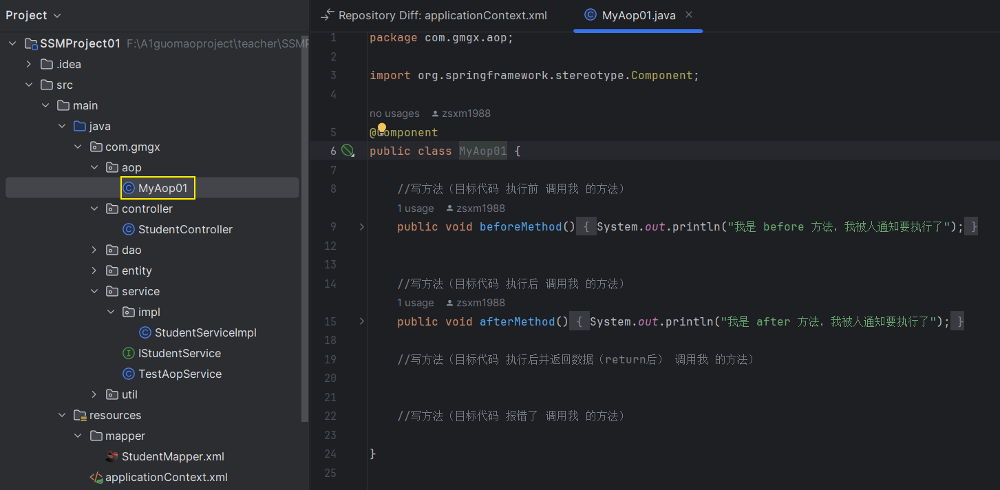
    - 添加配置 (applicationContext.xml)
        - 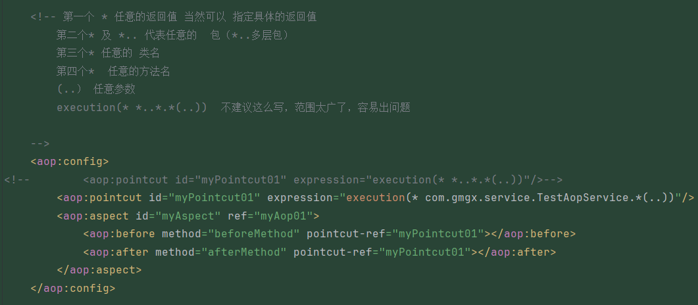
        - 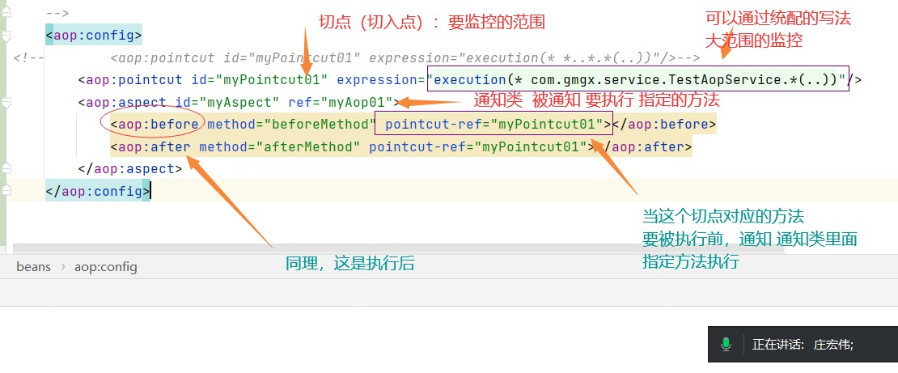
- 通知类型 (写在 第二步 写的那个aop 文件夹 的类中 也是 添加配置的那个类)
    - 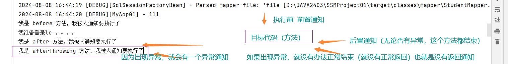
    - 前置通知
    - 执行结束通知
    - 返回通知
    - 异常通知
    - 环绕通知 (相当于 4合1 通知)
        - 继续连接点
            - 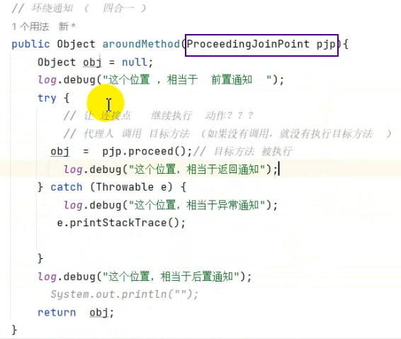
                - 返回值是 Object
        - 获得参数
            - 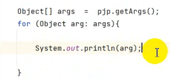

## 日志打印

- 这种实现方式 会将内容 保留到 本地日志文件中 (如果有配置的话)
- 代码实现
    - 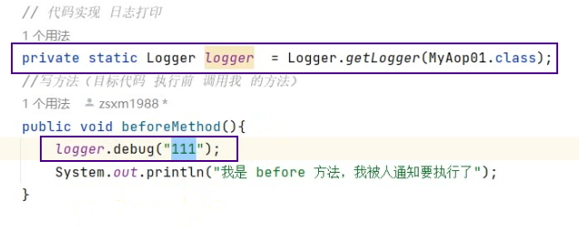
    - ``````
      Log4j 提供了以下日志级别，从高到低依次为：

      FATAL：记录非常严重的错误，导致程序中止运行。
      ERROR：记录错误事件，但程序可以继续运行。
      WARN：记录可能会出现问题的警告信息。
      INFO：记录一般信息，描述程序的运行状态。
      DEBUG：记录详细信息，用于调试。
      TRACE：记录更为详细的信息，通常用于跟踪程序的执行流程。
- 用注解实现
    - 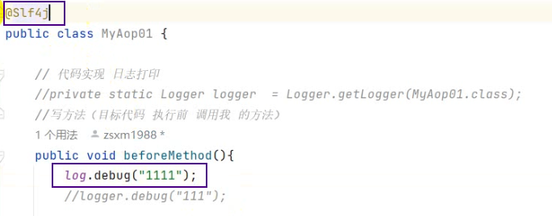
    - 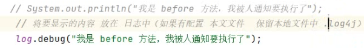

## 报错处理

- ajax 要配置 (applicationContext.xml)
    - 

- 

## 截图寄存处
