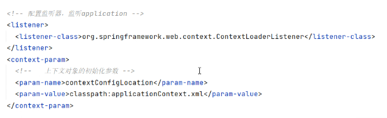

# Note 240808

## Review

- SpringMVC 流程图
    - 前端控制器
        - /
            - 路径都会经过他
        - 获得请求路径
        - 类似 过滤器
    - 视图解析器
        - 
    - 核心
        - 

## SSM

### log4j.properties

- 日志文件 的 地址 以及 超过指定大小 后进行备份
    - 
- 最大备份数量
    - 
    - .1是下标
        - 

### applicationContext.xml

- 除了 controller 其他都经过这
    - 

### springmvc-servlet.xml

- 跟视图解析器有关
- 控制 controller
    - 

### web.xml

- 跟前端控制器有关
- 这段配置代码的主要作用是设置和初始化 Spring 应用上下文。通过 ContextLoaderListener 监听器，Spring 可以在 web
  应用程序启动时自动加载配置文件并初始化应用上下文。contextConfigLocation 参数指定了 Spring 配置文件的位置，确保 Spring
  能找到并加载这些配置。
    - 
    - 

### Spring 和 Mybatis 需要整合

- 

### sqlMapConfig.xml

- 设置别名
    - 
- 再到 applicationContext.xml 进行配置
    - 

## 报错处理

- ajax 要配置 (applicationContext.xml)
    - 

- 

## 截图寄存处
