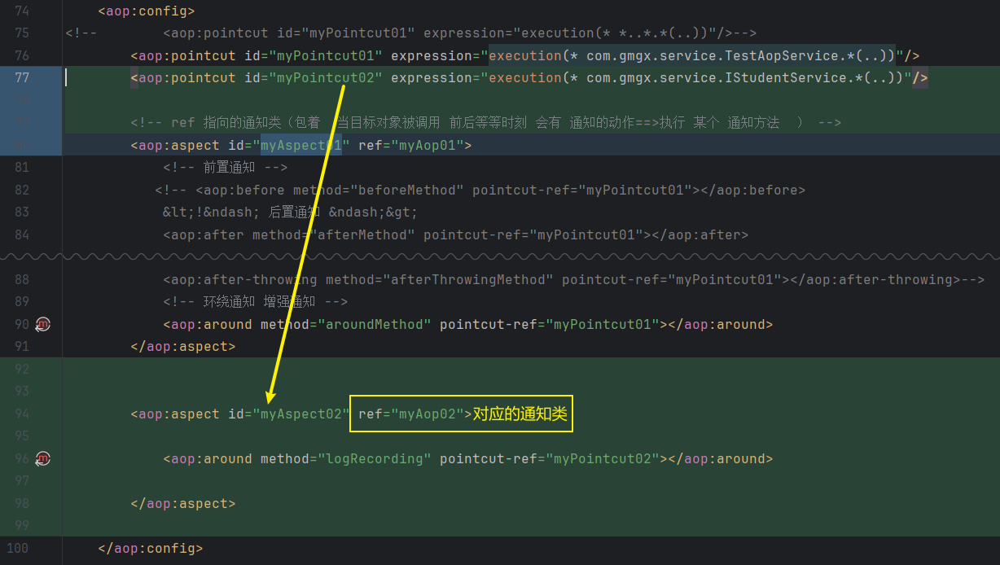
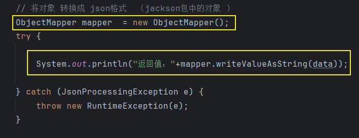

# Note 240809

## Review

- 两种代理
    - jdk 代理
    - cglib 代理

## AOP

- applicationContext.xml 配置
    - 

- 切点
    - 
    - 切点表达式解析
        - 
        - 精确 切点范围
            - 任意返回的 com.gmgx.service 任意的类和方法
                - `<aop:pointcut id="myPointcut03" expression="execution(* com.gmgx.service.*.*(..))"/>`
            - 通过 * 配合，实现 显示 部分 统配 I*Service 以I开头 以Service 结尾的类（接口）
                - `<aop:pointcut id="myPointcut03" expression="execution(* com.gmgx.service.I*Service.*(..))"/>`
            - IStudentService 包底下的 任意 方法 任意返回值 任意参数
                - `<aop:pointcut id="myPointcut03" expression="execution(* com.gmgx.service.IStudentService.*(..))"/>`
            - 通过 * 配合，实现 显示 部分 统配 query* 以query开头 任意方法（接口）
                - `<aop:pointcut id="myPointcut03" expression="execution(* com.gmgx.service.IStudentService.query*(..))"/>`
            - 通过设置 参数类型，缩小 切点范围（精准节点范围）
                - `<aop:pointcut id="myPointcut03" expression="execution(* com.gmgx.service.IStudentService.*(Integer))"/>`
                - `<aop:pointcut id="myPointcut03" expression="execution(* com.gmgx.service.IStudentService.*(com.gmgx.entity.Student))"/>`
                - `<aop:pointcut id="myPointcut03" expression="execution(boolean com.gmgx.service.IStudentService.*(..))"/>`
                - `<aop:pointcut id="myPointcut03" expression="execution(com.gmgx.entity.Student com.gmgx.service.IStudentService.*(..))"/>`
    - aop 中 涉及 当 对应的切点 对应 的范围（方法）相同（重叠的情况下）
        - 与切面的顺序有关
        - 2 如果设置 order 属性，根据属性 排序 （ 升序 ） 1 2 3
            - 
- 切面
    - 
- 环绕通知
    - 获得 request 信息
        - 
    - 为什么通知类 能 获取 request
        - 
    - 获得 类名 方法名 参数
        - 
    - 获得 返回值
        - 
    - 计算执行时间
        - 
    - 将对象 转换成 json格式 （jackson包中的对象 ）
        - 

## 报错处理

- 关于 log4j本地文件 乱码解决方案
    - 在 log4j 配置文件 加上 log4j.appender.R.encoding=gbk
        - 

## 截图寄存处