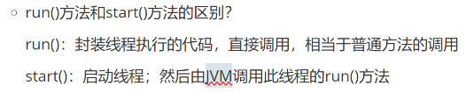

# Note

## Review

- 类 在 java 中是 单继承
- 接口 在 java 中可以是 多继承 的

## 多线程

- 开发中少用 , 一般都是直接加服务器(用钱解决)
- 线程安全问题及解决
- 三种创建方式
    - 方式一
        - 继承 Thread 重写 run()
        - 使用场景: 简单实现多线程的情况
            - 
                - Q: run() 和 start() 的区别
                    - run() , 其实就是调用了一个普通的方法
                    - start() , 采用多线程的方式去跑
                    - 
                - Q: 调用Start() , 线程里面的业务逻辑就立刻开始运行了吗?
                    - 不一定 , 有可能没抢到 执行权(处理机资源)
                - Q: th1 先调用了start() th2再调用start() ,th1 就先执行
                    - 不一定 , 因为不知道谁先抢到 执行权
    - 方式二
        - 实现 Runnable 接口
            - 使用场景: 不需要线程执行的返回值
            - 步骤
                - 
    - 方式三
        - 实现 callable 接口
            - 使用场景: 需要线程的返回结果
            - 步骤
                - 创建线程类对象
                - FutureTask
                    - FutureTask 是 Runnable 的 孙子接口
                - Mycallable
            - 注意:
                - futureTask.get() 放的位置很重要
                    - futureTask.get() 是阻塞方法( 等待 futureTask 的return ) , 所以 futureTask.get() 要在
                      thread.start() 之后
- 线程的常用方法
  - Thread.sleep()
    - sleep(1000) , 通常时间是不准确的 , 比 1000 稍长一些 , 有可能 sleep 之后 没抢到 执行权
  - get/setName()
  - currentThread()