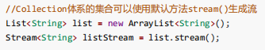

# Note

## Review

- 类 在 java 中是 单继承
- 接口 在 java 中可以是 多继承 的

## 多线程

- 开发中少用 , 一般都是直接加服务器(用钱解决)
- 线程安全问题及解决
- 三种创建方式
    - 方式一
        - 继承 Thread 重写 run()
        - 使用场景: 简单实现多线程的情况
            - 
                - Q: run() 和 start() 的区别
                    - run() , 其实就是调用了一个普通的方法
                    - start() , 采用多线程的方式去跑
                    - 
                - Q: 调用Start() , 线程里面的业务逻辑就立刻开始运行了吗?
                    - 不一定 , 有可能没抢到 执行权(处理机资源)
                - Q: th1 先调用了start() th2再调用start() ,th1 就先执行
                    - 不一定 , 因为不知道谁先抢到 执行权
    - 方式二
        - 实现 Runnable 接口
            - 使用场景: 不需要线程执行的返回值
            - 步骤
                - 
    - 方式三
        - 实现 callable 接口
            - 使用场景: 需要线程的返回结果
            - 步骤
                - 创建线程类对象
                - FutureTask
                    - FutureTask 是 Runnable 的 孙子接口
                - Mycallable
            - 注意:
                - futureTask.get() 放的位置很重要
                    - futureTask.get() 是阻塞方法( 等待 futureTask 的return ) , 所以 futureTask.get() 要在
                      thread.start() 之后
- 线程的常用方法
    - Thread.sleep()
        - sleep(1000) , 通常时间是不准确的 , 比 1000 稍长一些 , 有可能 sleep 之后 没抢到 执行权
    - get/setName()
    - currentThread()

### 线程安全

- synchronized()
    - () 里面 能放
        - this
        - Object 对象
        - ***.class 字节码文件
- 用什么锁?
    - 锁定当前实例对象（this）：适用于实例级别的锁，需要同步实例方法或代码块。
    - 锁定共享对象(Object)：适用于同步特定的共享资源，多个实例共享同一资源。
    - 锁定类的字节码对象（Class对象）：适用于类级别的锁，需要同步静态方法或静态资源。

## Stream (流)

- 怎么获取流?
    - 
- 中间方法
    - filter()
        - 过滤
            - 
        - 可以多 filter
        - 注意:
            - 有了 forEach (遍历完就 关流 了) 就不能 filter()
    - concat()
        - 流拼接 (合流)
    - distinct()
        - 去重
    - limit()
        - 限制输出个数
    - skip()
        - 跳过 几个
    - collect(Collectors.to**())
        - 收集

- 终结方法
    - forEach():遍历 并且 完成后 关流(流就不能再操作了)
    - count(): 计数 之后 不能再调用 任何方法了
