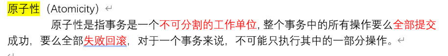
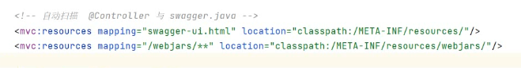

# Note 240812

## Review

- AOP
    - 表达式
        - 
        - 
        - 
        - 
    - 通知类
        - @Component (使用注释 将通知类 IOC 到 Spring 容器中 ,后面直接用 , 不用再配 bean 标签)
        - 五个 方法(通知)
            - 
        - 切面 切点
            - 
            - 
        - 

## 事务 (Transaction)

- ACID
    - 原子性
        - 
    - 一致性
        - 
    - 隔离性
        - 
    - 持久性
        - 
- 作用在那一层
    - Service
    - 
- applicationContext.xml 配置
    - 
- 业务逻辑层 实现类 事务注解 @Transactional
    - 某方法 方法前
        - 
- 回滚
    - 如果遇到异常 在没有捕获的情况下 事务会启动回滚机制
    - 如果遇到异常 捕获了 就手动实现回滚
        - 

## Swagger2

- 依赖
- 配置类 (SwaggerConfig)
  
- 配置 springmvc-servlet.xml
    - 
    - 
    - 访问路径名
        - 
- 对应 Controller 加 注解
    - 
    - 
- 进一步简化
    - @RestController 注解
    - 是一个综合注解
        - 
    - 发现 请求映射 注解 随着配置 请求类型 ，变得很长
        - 
        - 使用 @GetMapping("queryAllStudent")
            - 
        - 同理:
            - @GetMapping 查询
            - @PostMapping 添加
            - @DeleteMapping 删除
            - @PutMapping 修改

- restFul方式
    - ``````
      （了解，在当前的项目中，可以找几个简单功能（模块）尝试一下，不一定要都用，至少了解如何使用）  后端程序员来说，如果要完全遵照RestFul ，就要 想着 将所有的请求都变成 增删查改。
       另外，get post最常用 安全性 post最好 ，put delete 安全性不一定很高，有些地方不一定支持
       通过  get   post   put   delete  四种请求方式来分工
             查     增    改       删
    - 优点: 让地址栏更加简单
    - 可实现，路径一样，method的值不一样，有不一样效果：
        - 
        - Swagger 页面中 , 暴露:
            - 
            - 
        - Postman 软件上测试
            - 
    - 注意 :
        - 通过 restful风格传参：
            - 
    - 解释：为什么要配置 paramType = "path"
        - 
    - 多参数
        - 
    - @PathVariable 配置 路径变量
        - 
        - 

## 报错处理

- springmvc-servlet.xml 配置拦截器 报错 , 但是并不影响运行结果
    - 
        - 

## 截图寄存处

- 
