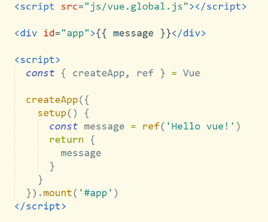
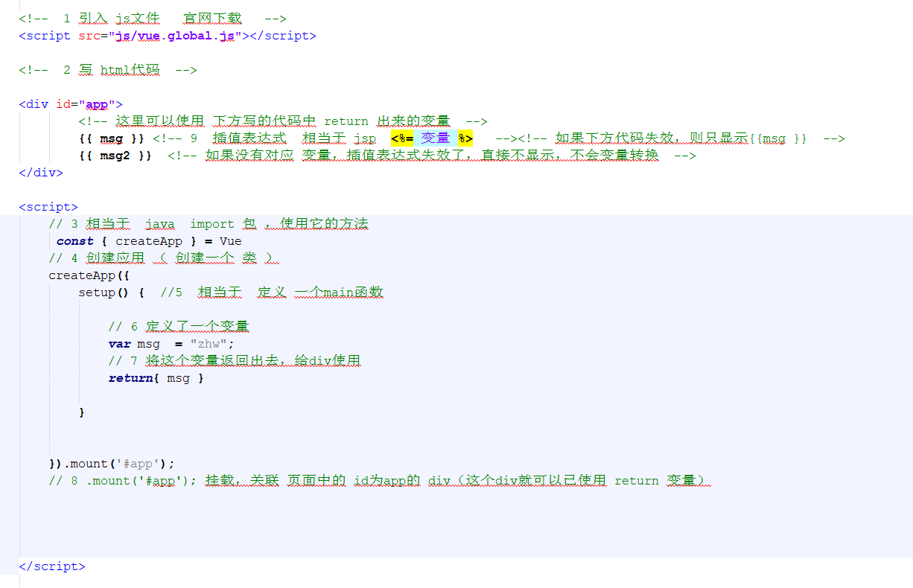
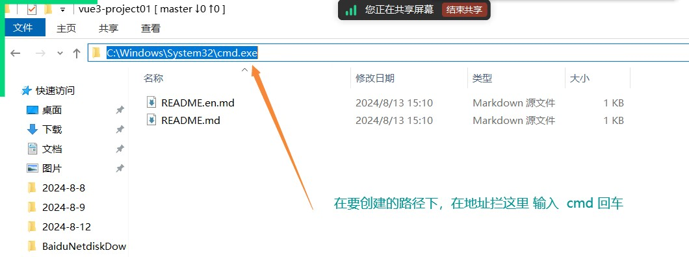
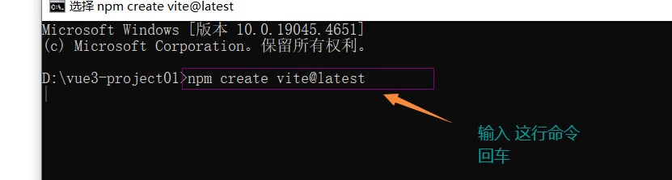
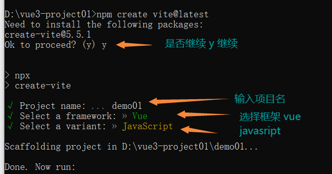
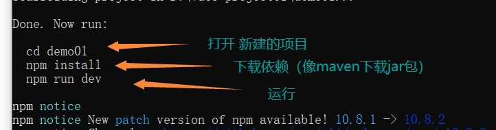
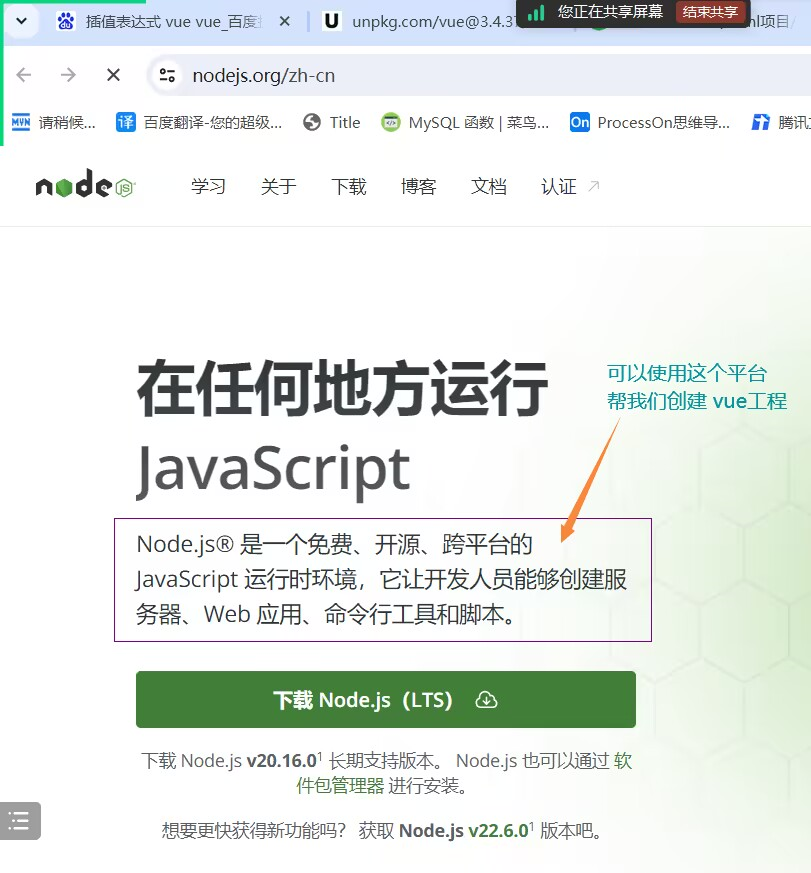

# Note 240813

## Review

- Swagger2

## Vue

- 链接:
    - https://cn.vuejs.org/guide/introduction.html
- Vue2
    - 选项式
- Vue3
    - 组合式
    - 可以省略 return

### Vue3

- 创建方式
    - 方式1
        - Vue3 的开发 可以 简单用 html 的方式 实现
            - 
        - 创建步骤
            - 在 html body 中
                - 
    - 方式二
        - vite 方式
            - 步骤
                - 安装 node.js
                - 
                - 
                - 
                - 
            - 注意 :
                - 如果 npm install 太慢 运行 `npm config set registry https://registry.npmmirror.com`
                    - 或者 # 安装cnpm ` npm install -g cnpm -registry=https://registry.npmmirror.com`

- 插值表达式
- 变量的声明
    - var
        - 弱类型的写法
    - let
        - 精准声明
    - const
        - 最终什么 变量不可改

## node.js

- 
- Link:
    - https://nodejs.org/en/
- 安装步骤
    - 下载安装包
    - 右键安装
    - 选择路径(在某盘新建一个文件夹)
    - 无脑next

## 报错处理

## 截图寄存处