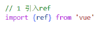
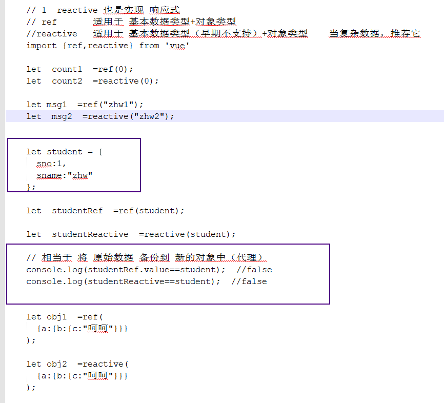
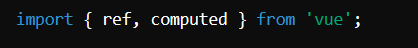
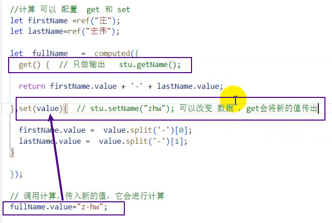
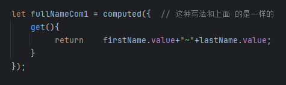

# Note 240814

## Review

## Vue3

### 响应式数据 的 API

- ref
    - 用途
        - 用于创建一个包含基本数据类型（如 string、number、boolean）的响应式引用。它也可以用于处理简单的对象（但通常 reactive
          更适合对象）。
    - 使用步骤
        - 引入 ref
            - 
        - 需要通过 value 属性来访问或修改其值
    - 特点
        - ``````      
          ref 创建的是一个包含 value 属性的响应式引用。你需要通过 value 属性来访问或修改其值。
          它适合用于处理简单数据或单一值，尤其是在组件的 setup 函数中。
          对于对象，ref 会将对象包装在 ref 中，而不是深度响应式处理。
    - 适用于
        - 基本数据类型 + 对象类型
    - 代理对象
        - 

- reactive
    - 用途
        - 用于将一个对象（包括嵌套对象）转换成响应式对象。
    - 使用步骤
        - 引入 reactive
            - 
    - 特点
        - ``````
          reactive 创建的是一个深度响应式的对象。所有的嵌套属性都会被转换成响应式属性。
          它适合用于处理复杂的对象或数据结构，比如包含多个层级的对象。
          当你修改嵌套的属性时，Vue 会自动追踪这些变化。
    - 适用于
        - 基本数据类型 (早期版本不支持) + 对象类型
        - 复杂对象或数据结构
    - 代理对象
        - 

### 计算属性

- computed()
- 特点
    - ``````
      缓存: 计算属性会根据其依赖的数据进行缓存，只有在依赖的数据发生变化时才会重新计算。这样可以避免不必要的计算，提升性能。
      自动依赖追踪: Vue 会自动追踪计算属性依赖的数据，当这些依赖的数据发生变化时，计算属性会自动更新。
      读写: 计算属性支持 getter 和 setter，你可以定义计算属性的同时定义其设置逻辑。

- 使用步骤
    - 引入依赖
        - 
    - 创建响应式数据
    - 定义计算属性
    - 在模板中使用计算属性
    - 处理计算属性的设置（可选）

- get set 写法
  -  
## 箭头函数写法
- `let calcCom2 = computed(()=> num1-num2 );`
  - 只有返回值 , 单行代码 , 可以省略花括号
- 
- 普通函数写法 与 箭头函数写法 效果是一样的 


## 报错处理

## 截图寄存处