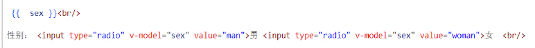

# Note 240815

## Review

- 
- 插值表达式 里面可以用 三目运算符

## Vue3

### 事件处理

- 点击事件
    - 我们可以使用 v-on 指令 (简写为 @) 来监听 DOM 事件，并在事件触发时执行对应的 JavaScript。用法：v-on:click="handler" 或
      @click="handler"。
    - 
    - 弹出框的写法
        - 方法的小括号可以省略
            - 
- 事件修饰符
    - Vue 为 v-on 提供了事件修饰符。修饰符是用 . 表示的指令后缀，包含以下这些：
        - .stop
            - 
        - .prevent
            - 
            - 链式调用
                - 
        - .self
        - .capture
        - .once
            - 
        - .passive

### 表单输入绑定

- v-model
    - 双向绑定的
    - 
    - `<textarea></textarea>`
    - 
    - 复选框
        - 
    - 单选框
        - 
        - 指定 值
            - 
    - 下拉框
        - 
        - 
        - 多选
            - 
        - 动态反显下拉框
            - 
            - 
        - 值绑定
            - 
        - 修饰符
            - .lazy
                - 
            - .number
                - 如果你想让用户输入自动转换为数字，你可以在 v-model 后添加 .number 修饰符来管理输入
                    - 

### 生命周期

- 生命周期
    - 
- 钩子函数
    - ..

### 侦听器

- 侦听 一个属性
    - 
- 侦听 一个对象
    - 深侦听
    - 
        - 更改对象
            - 
    - 侦听 对象属性
        - 
    - 侦听 对象的属性也是对象
        - 
- 侦听器 死循环
    - 
- 侦听器 返回值
    - 返回值是 停止函数 , 调用的时候 ,让当前监听器停下来
        - 

## 报错处理

## 截图寄存