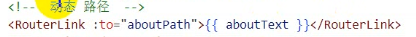
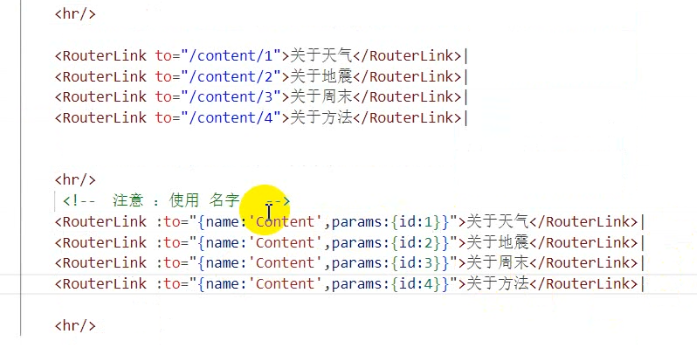

# Note 240816

## Review

## Vue3

### 路由

- 安装路由 , 加依赖
    - 
- 配置 Vue router文件
    - router/index.js
        - 
- main.js
    - 
- App.vue
    - 

- 配置多个路由
    - router/index.js
        - 
        - 注意 :
            - history:createWebHistory()
                - 使用 HTML5 History API 进行路由管理，URL 看起来更干净，没有哈希 (#) 符号。
            - history:createWebHashHistory()
                - 使用 URL 哈希部分进行路由管理，适合不支持 HTML5 History API 的浏览器。
        - App.vue
            - 
- 父子关系
    - router/index.js
        - 
    - New.vue
        - 

- 路径
    - 不加 / 是 相对路径
    - 加 / 是根路径
    - 
    - 关于二级路径
        - 
        - 

- 重定向 (index.js)
    - 

- 路由跳转
    - 
    - router.push() 跳转
        - 
    - 动态路径
        - 使用绑定
            - 
            - 
            - 
            - 

- 路由传参
    - 
    - query 查询
        - 步骤
            - 
            - 
        - 具体代码
            - index.js
                - 
            - 
            - 接收
                - 
            - router.push() 跳转方式
                - 
                - 
    - param
        - 步骤
            - 
            - 
            - 具体代码
                - index.js
                    - 
                - 
                - 接收
                    - 
                - router.push() 跳转方式
                    - 
                    - 

- 路由守护
    - 全局守护
        - 
        - 状态管理
            - index.js
                - 
        - 权限控制
            - 
            - 
        - 懒加载
            - index.js
                - 
        - 销毁问题
            - 

## 报错处理

- 配置 Swagger 单元测试 会报错
    - 
    - 方式二
        - 

- 关于 日期的转换 （Date 转换成 json 格式 ）
    - 请求：@DateTimeFormat(pattern = "yyyy-MM-dd HH:mm:ss", iso = DateTimeFormat.ISO.DATE_TIME)
    - 响应：@JsonFormat(pattern = "yyyy-MM-dd HH:mm:ss",timezone = "GMT+8") 添加在 对应的Date属性上面
    - 
    - 
    - 

## 截图寄存处