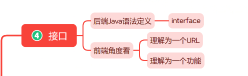
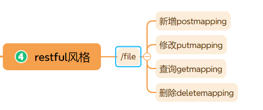
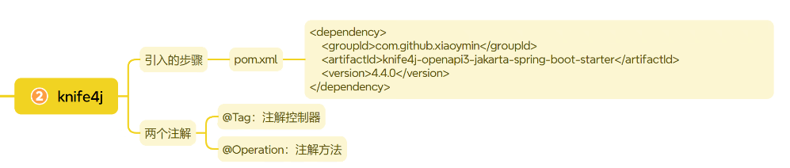
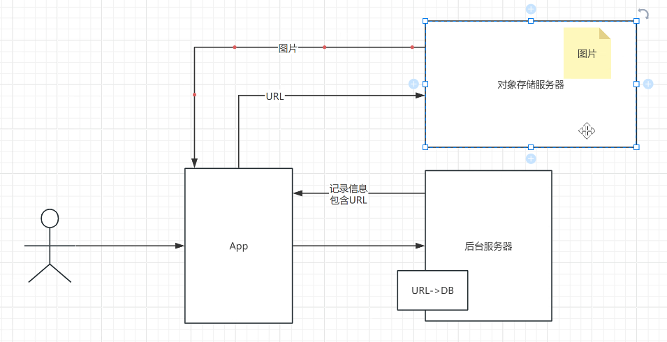
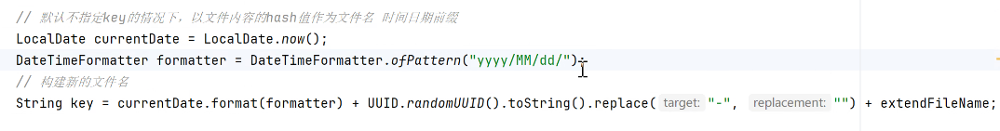
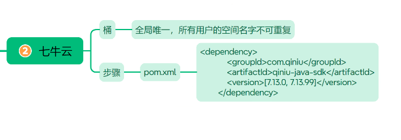

# note 240818

## 接口

- 命名 前缀 加 I
- 

## restful

- 

## knife4j

- 引入的步骤
    - pom.xml
- 两个注解
    - @Tag 注解控制器
    - @Operation 注解方法
- 

## 文件上传的过程

- 

## 七牛云 (对象存储服务器)

- 公开
    - 桶(空间)
        - 全局唯一 , 所有用户都不能取重复
    - ak 和 sk (与空间无关)
        - 获取
    - 文件名的定义规则
        - 
    - 
- 私有
-

## 学第三方的东西 一定要看官网
