# Note 240819

## Vue3

### 状态管理

- Pinia
    - 引入 Pinia
        - 官网 : https://pinia.vuejs.org/zh/
        - 安装 pinia
            - npm install pinia@latest
    - main.js
        - 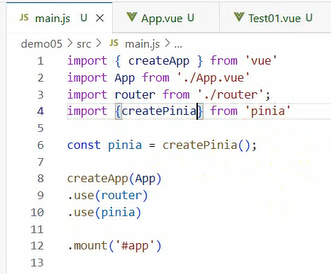
    - 路由
        - 引入 : npm i vue-router@latest
        - 新建 touter 文件夹
            - 新建 index.js
                - 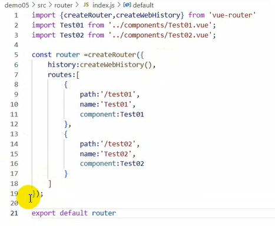
                - 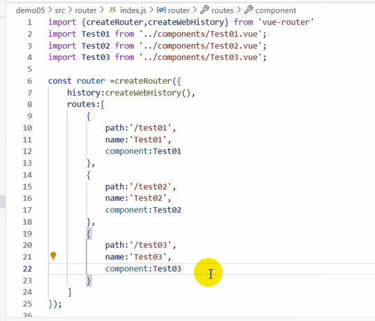
    - 在 src 文件夹下 创建一个 stores 文件夹
        - 新建一个文件 (比如 : countStore.js)
            - 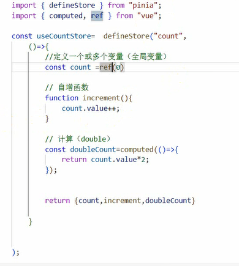
        - studentStore.js
            - 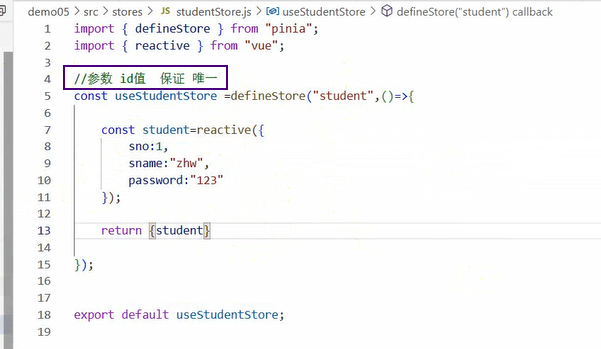
    - Components 文件夹下
        - Test1.vue
            - 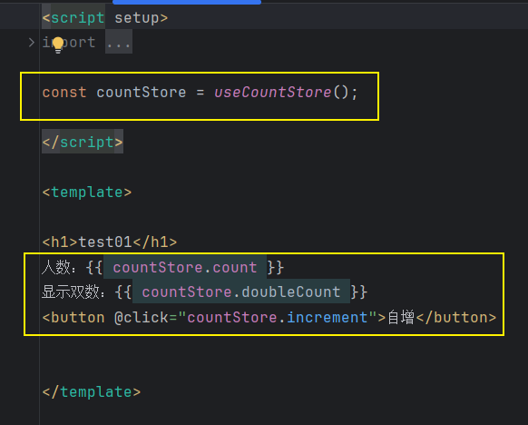
        - Test2.vue
            - 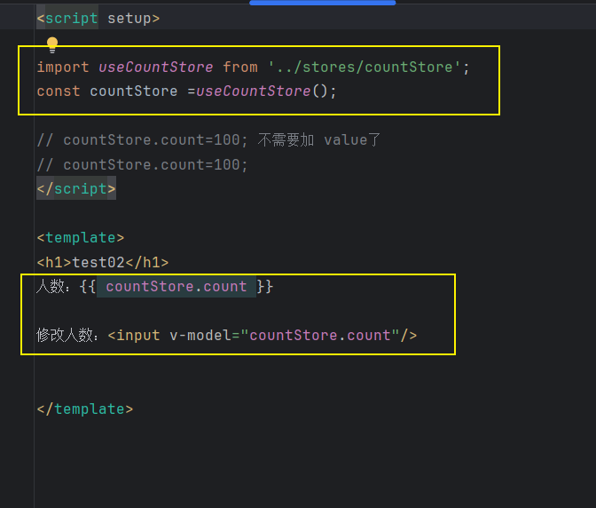
        - Test3.vue
            - 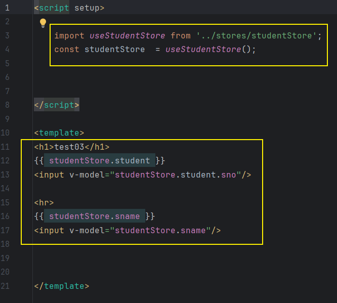
    - App.vue
        - 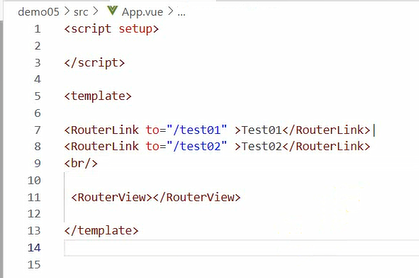
        - 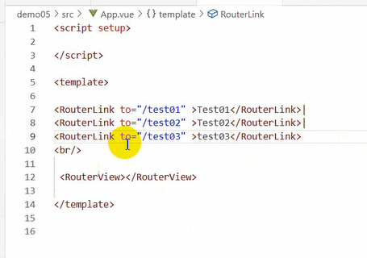

    - 持久化
        - 官网 : https://prazdevs.github.io/pinia-plugin-persistedstate/zh/guide/
        - 引入
            - npm i pinia-plugin-persistedstate@latest
        - main.js
            - 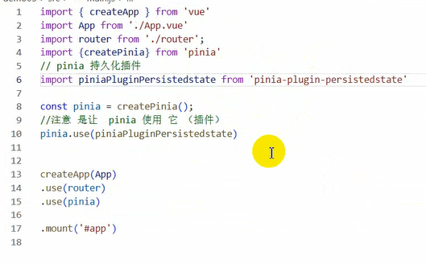
        - stores 文件下
            - 方式一
                - 要 持久化 的 状态文件 比如 countStore.js
                    - 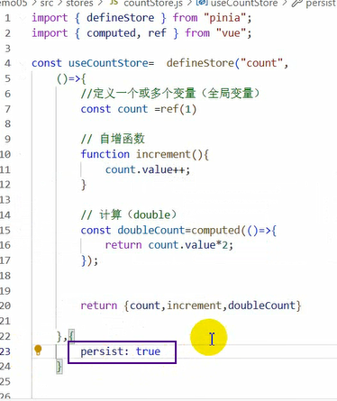
                    - 这种写法默认保存在 localstorage (持久的 , 除非手动清除)
            - 方式二
                - 要 持久化 的 状态文件 比如 studentStore.js
                    - 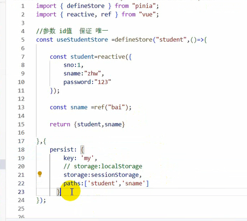
                    - 或者
                        - 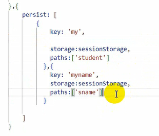

### axios

- 导入
    - npm i axios@latest
- 写法
    - 旧
        - 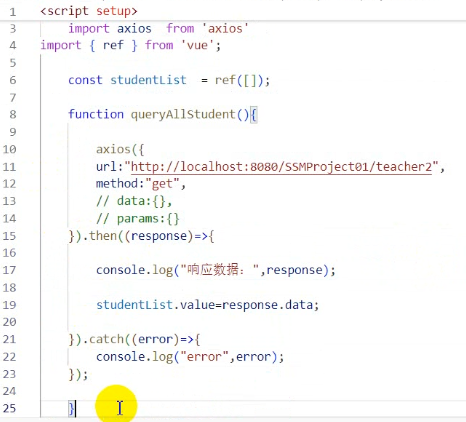
    - 新
        - 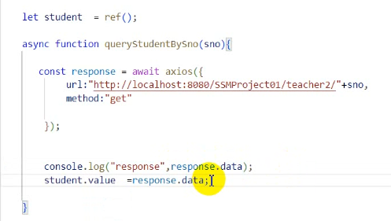
- 配置
    - 二次封装
        - src 下 创建 utils 文件夹
            - 创建 request.js 文件
                - 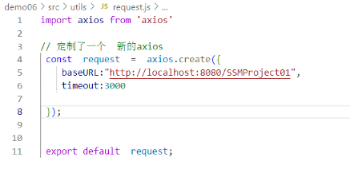
                - 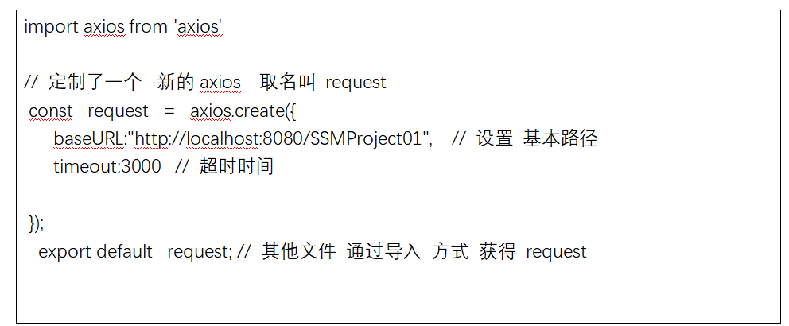
        - src 下 创建 api(请求路径) 文件夹
            - 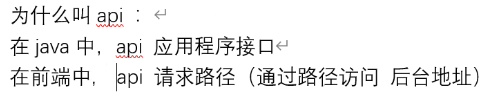
            - 创建 .js 文件 比如 : teacher.js
                - ``````
                  post :将请求数据放在 header（报文中）  传递数据类型：data   
                  直接用：data:对象 无法正常传递 需要 借助 qs工具 
                         qs.stringify({
                             student
                          })
                  put和 post一样；
                  get：放在路径上   传递数据类型：params   会将数据放在地址栏中
                  虽然 params 可以顺利 传递，但 不安全（请求数据放在地址栏中） 
                  /SSMProject01/teacher2/queryStudentBySname?sno=1&sname=zhw....
                  delete 和 get一样
                  

                - qs 工具需要导入
                    - npm i qs@latest
                    - 在 .js 文件中
                        - `import  qs from 'qs'`
                - 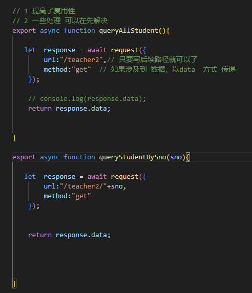
                - 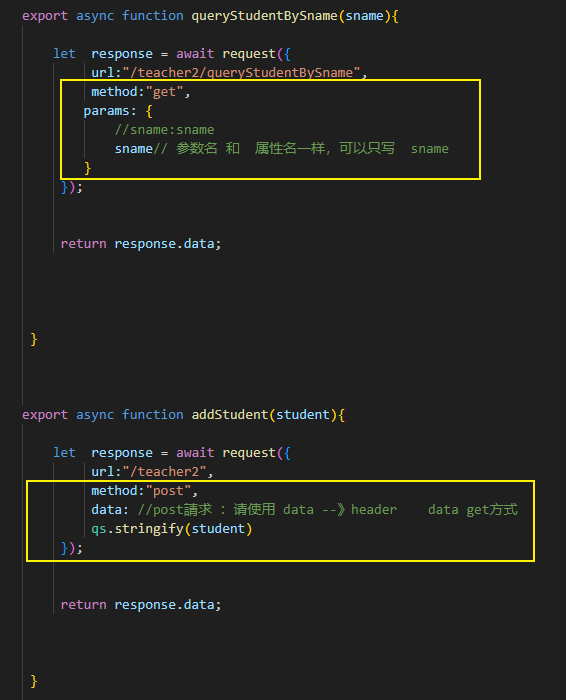
                - 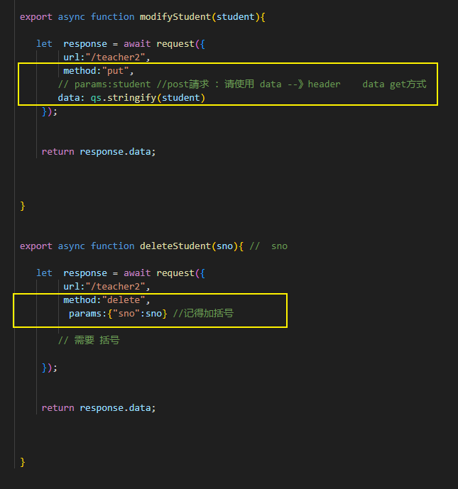
        - 需要使用 axios 的组件里 比如 *.vue
            - 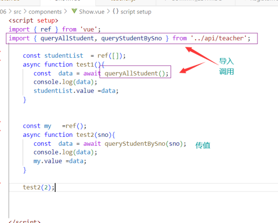
    - 文件夹含义 补充说明
        - 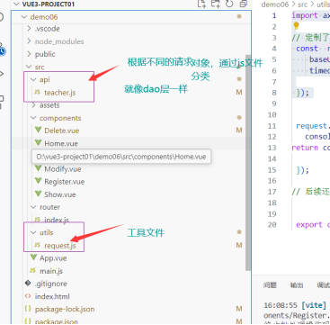

## 报错处理

## 截图寄存处