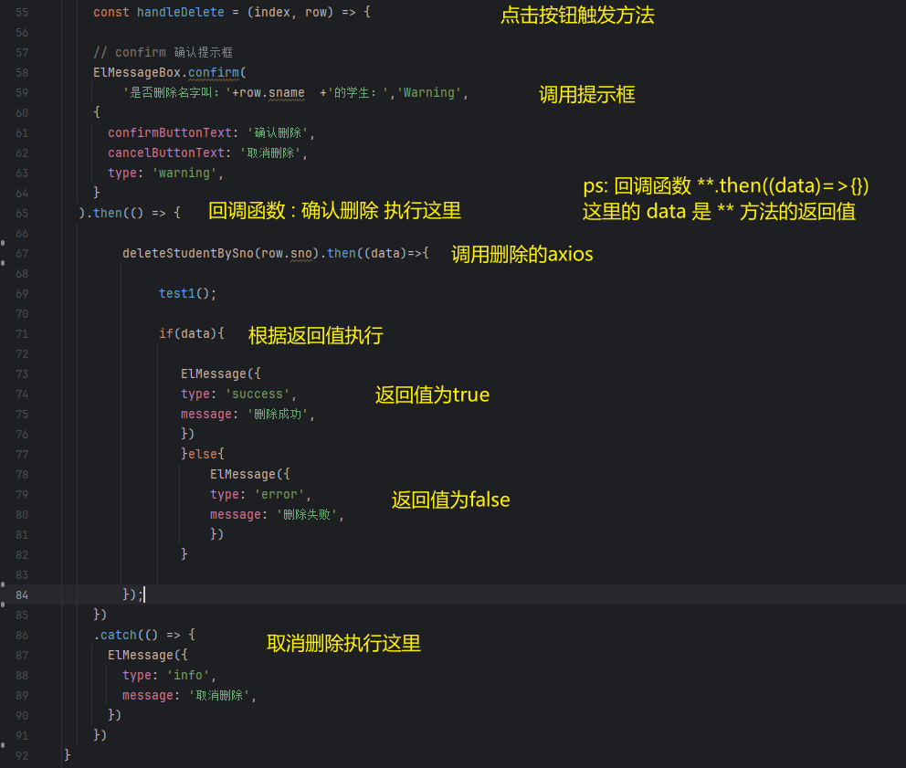

# Note 240820

## ElementPlus

- 官网 : https://s-test.belle.cn/zh-CN/

### 使用 ElementPlus

- 导入 (ElementPuls axios qs)
    - npm install element-plus –save
    - npm i axios@latest
    - npm i qs@latest
- main.js
    - 
- 创建一个文件夹
    - 写 axios
- 创建一个组件 里面使用 ElementPlus
    - 挂载到 App.vue
- 详细看 .doc 文档

### 表格

- 

### 删除

- 在表格上 加操作按钮
    - 
- 
- 在 方法里调用 提示框
1. 写 删除的axios 方法
2. 获取值 , 并且 触发方法 
3. 触发方法里 使用弹出框
4. 在弹出框 调用 删除的axios 方法 , 传入值 
5. 大致如下图
6. 

## 报错处理

- 做持久化 时差问题
    - 实体类
        - 
    - jdbc.properties
        - ``````
          //北京时间东八区
          serverTimezone=GMT%2B8
          //上海时间
          serverTimezone=Asia/Shanghai

        - 