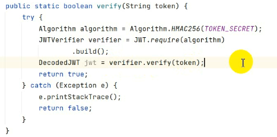
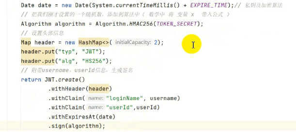
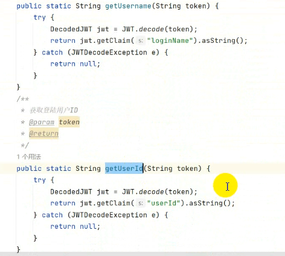
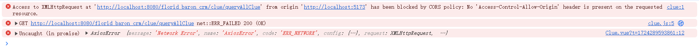
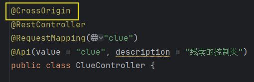
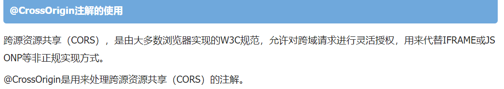

# Note 240822

## Review

## Token

- TOKEN_ SECRET 密钥 (自己保管)

- 验证
    - 
- 签名

- 过期时间

- JWT
    - 将密钥加到算法中,再将算法加到签名中
        - 

- 获得 用户名 和 用户id
  - 

## 报错处理

- 浏览器报错
    - 
    - 处理
        - 
        - 

## 截图寄存处