# Note 240823

## Review

## 权限控制 (登录校验)

- 前端后端都要做
- 后端
    - 准备工作
        - entity
            - Result.java
        - controller
            - 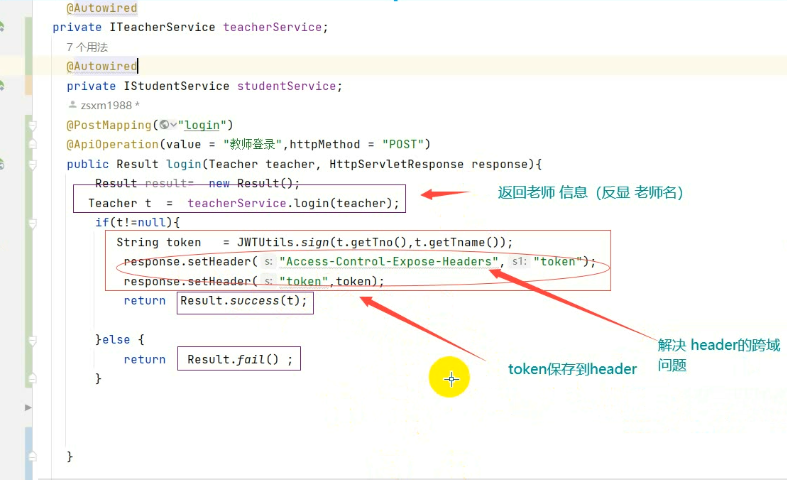
    - 拦截器
        - 预防问 , 获得 token 的操作
- 前端
    - 准备工作
        - Token 工具
            - 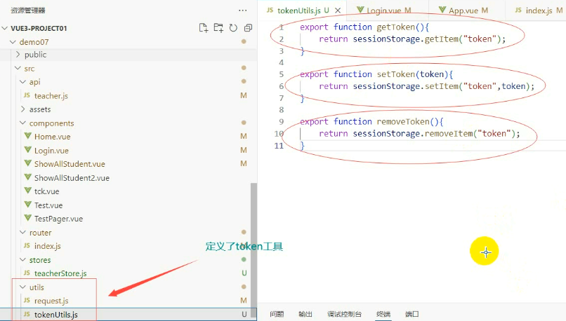
    - 路由守护
        - 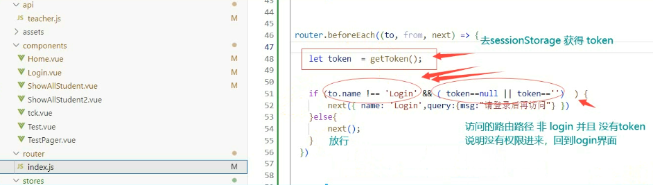
    - Axios 的 请求 和 拦截器
        - 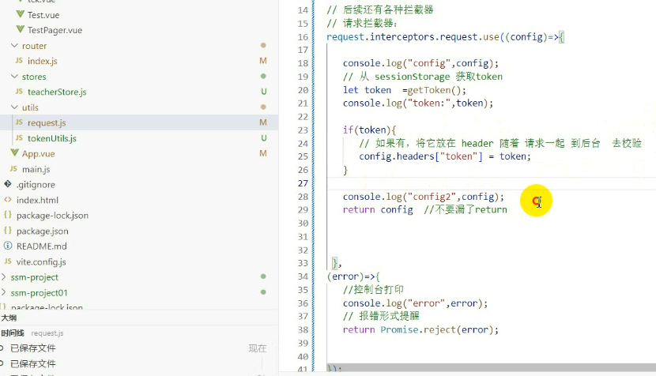
        - 响应
            - 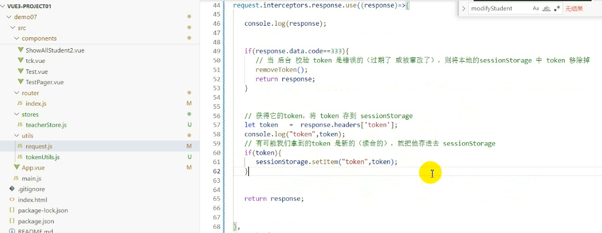
    - 登录界面
        - 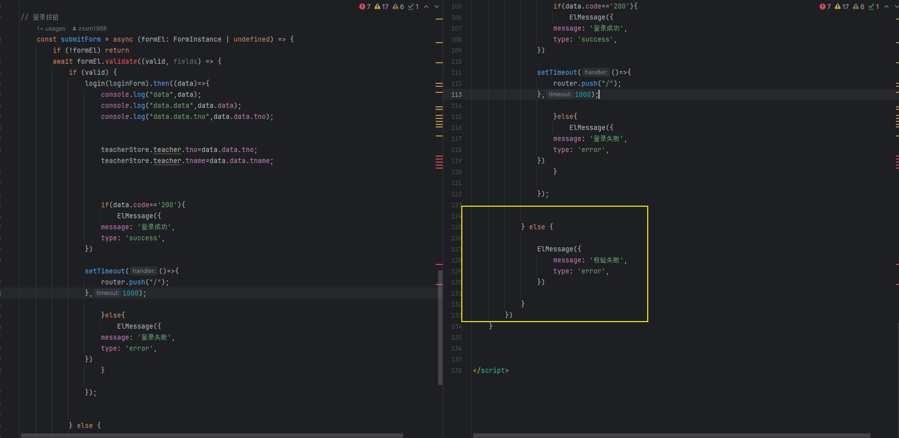
    - 状态管理
        - 准备工作: 确保有装 pinia
            - 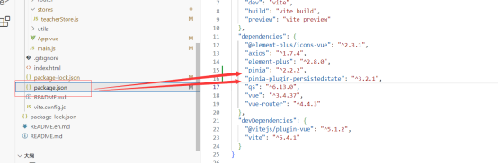
            - ``````
              npm i pinia@latest
              npm i pinia-plugin-persistedstate@latest
              
            - 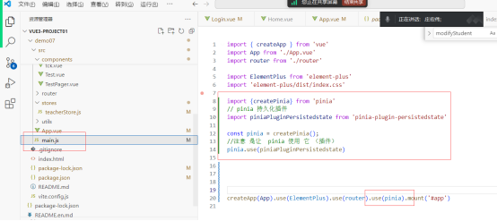
            - 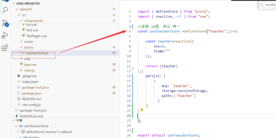
        - 登录成功后，将 tno  和 tname保存到 状态管理中
          - 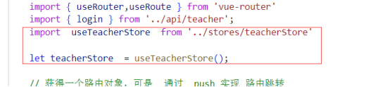
          - 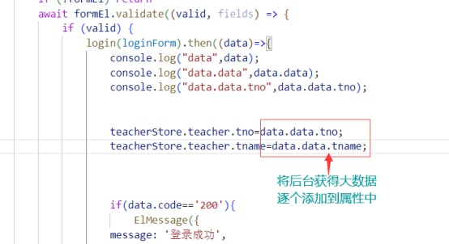
          - 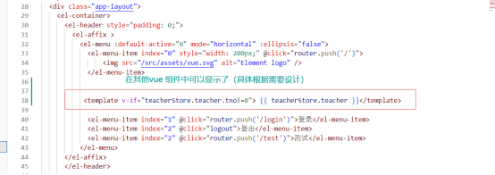
          - 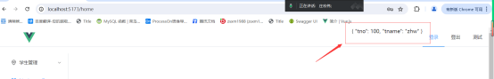

### 获取 Store 的数据

- 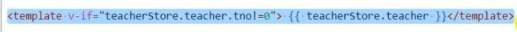

## 报错处理

## 截图寄存处