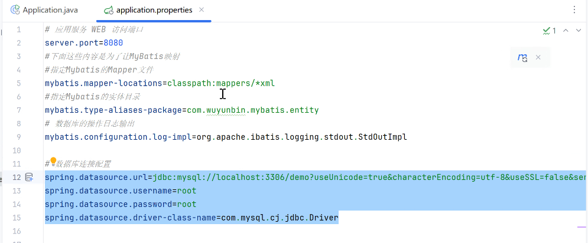
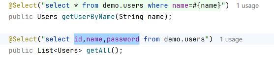
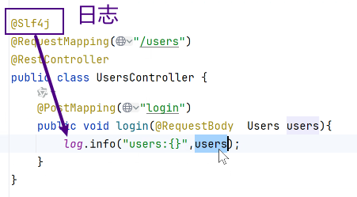

# Note 240825

## 基于 SpringBoot 完成双 Token 验证

### SpringBoot

- 对 Spring 的优化增强
- 约定大于配置
    - 简化配置
- 启动类
- 配置文件
    - 
- 配置类 注解
    - @Configuration
        - 加载到 bean 容器

### Token

- Token由三部分组成：
    - Header（表头）
        - 这部分是一个JSON对象，存储了元数据，包括签名算法的名称和令牌的类型。签名算法的名称（alg）和令牌的类型（typ）是Header的主要内容。例如，alg可以是HS256，表示使用的签名算法是HMAC
          SHA256；typ属性表示这个令牌的类型，对于JWT令牌，typ的值被设置为"JWT"。
    - Payload（负载）
        - 这部分也是一个JSON对象，用于存放传递的数据。这些数据可以分为Public和Private两部分。Public部分包括一些规定的字段，如签发人（issuer）、过期时间（expiration
          time）、面向的用户（subject）、受众（audience）、生效时间（not before）、签发时间（Issued At）和编号（JWT
          ID）。Private部分则是自定义的字段，可以存放一些敏感信息，但通常不建议存放敏感数据，因为Payload中的数据默认是没有加密的，是以明文形式传输的。
    - Signature（签名）
        - ````
          签名是对Header和Payload两部分的签名，目的是为了防止数据被篡改。签名算法使用一个secret密钥，对base64编码的Header和Payload进行加密，生成签名字符串。签名是将Header、Payload和secret密钥通过指定的加密方式（如HMACSHA256）进行计算得到的。最后，这三个部分被拼成一个字符串，每个部分之间用点(.)
          分隔，返回给用户。

- JWT (10:25~10:30)
    - 生成 和 解析
    - key
    - ttl
        - 结束时间

- extra
  - 双Token三验证
  - https://answer.baidu.com/answer/land?params=utTsEgtzCNoevudNcfUFTqALpSfmAh8oQ%2B2ql%2FtNEfHQXuhii2yvwIVlZF2D9l2Ei8RdMmqT06K3MsrLvN8o4hzqfZlR32FVz1SG5FNFiM%2F4xxLuHhu1Rm2O7jGzLt6%2BU%2FOBvX6eIlHTWkPilWp%2F7xBUWTvvYxlgziRjTmNguv3L4o3Zi%2FuxZ4Sr1rTIn0iLZz618e7xNORcKjfeBeORzQ%3D%3D&from=dqa&lid=f90a228a00ada16e&word=%E5%8F%8Ctoken%E4%B8%89%E9%AA%8C%E8%AF%81
  - 

## 数据库优化

- 查询优化
    - 
    - 这种方式效率高
- explain + sql语句 看效率
  - 看表的 type
- 优化
- type 优化到 index 或者 ref
  - 优化方案
    - 加 索引

## 截图寄存处

- 