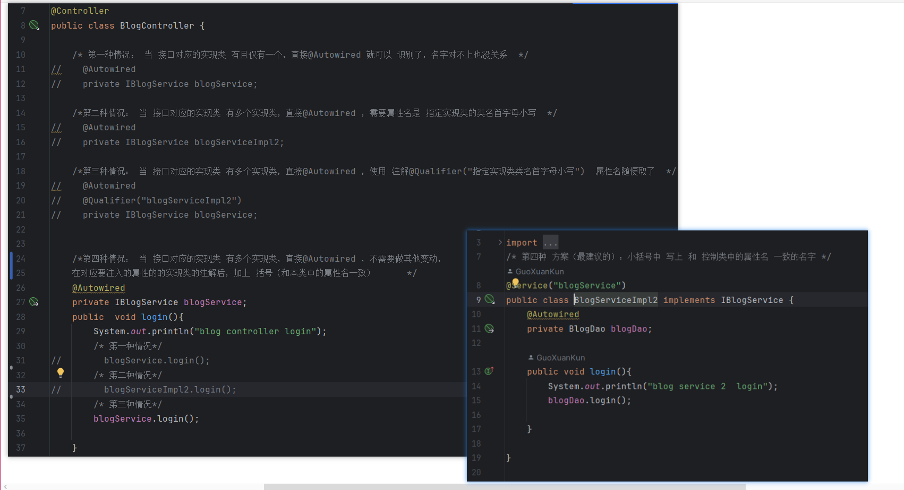
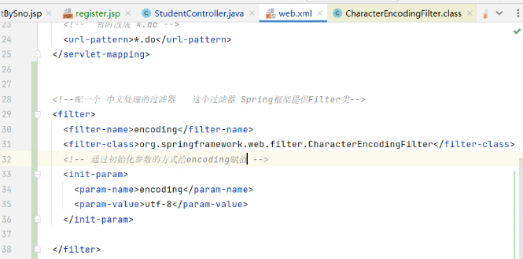
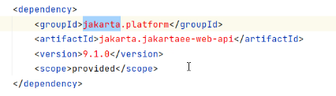

# Note 240805

## Review

### 有多个实现类

- controller
    - jdk 8 以及 之前
        - @Resource("实现类名") 需要导入新的 jar 包
    - jdk 8 之后 不支持 javax 包
        - ````
          @Autowire
          @Qualifier("实现类名")

    - ``````
        注意。如果对应接口 存在多个实现类，怎么处理呢？
        还是三种方式：
        1 修改属性名（不建议）
        2 在@Autowired 下面 再建一个 新的注解
        @Qualifier("studentServiceImpl2")  括号中的就是 指定的 接口的某个实现类的类名首字母小写
        （和@Resource 最大的区别：原先直接 在 注解后面加一个小括号 name=”xxxx”）
      
        3 修改 @Service("studentService") 小括号的值（和 控制层中的属性名一致）

- 

## SpringMVC
- 添加 中文过滤器
  - 

### 报错处理

- @Resource 没法加载出来
    - 解决方案:
        - 加依赖
            - 