# Note 240806

## Review

### SpringMVC

- 请求参数 的三种方式
    - 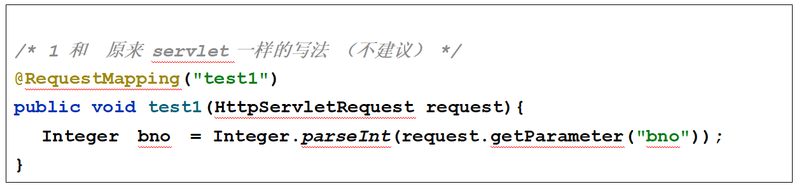
    - 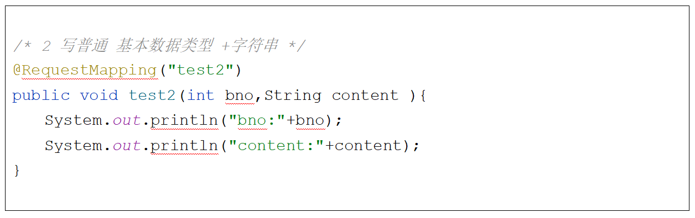
    - 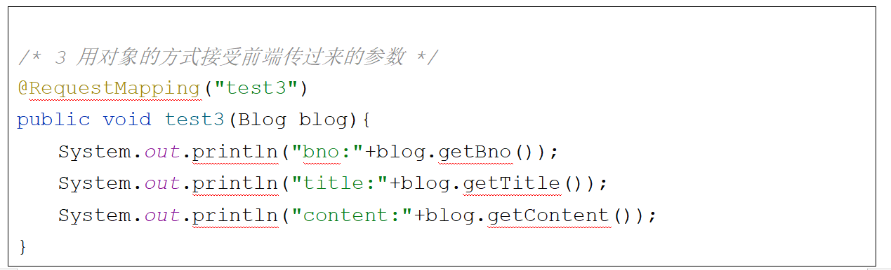
- 跳转页面 的方式
    - 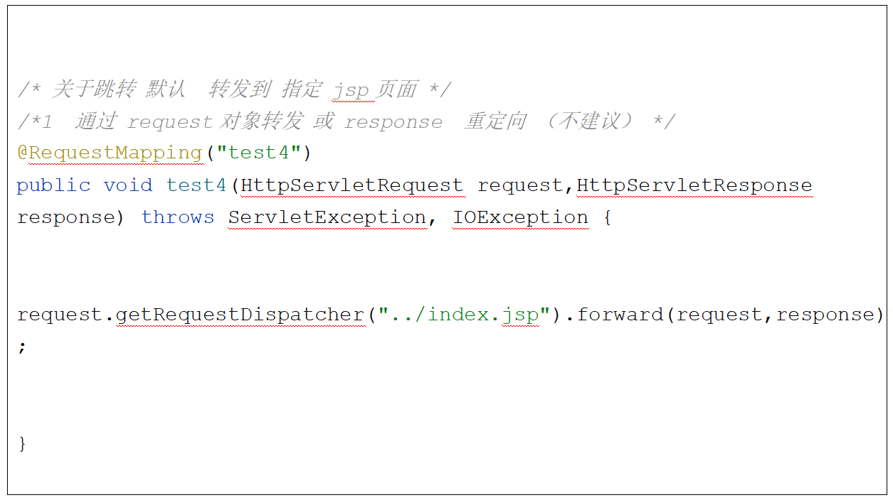
    - 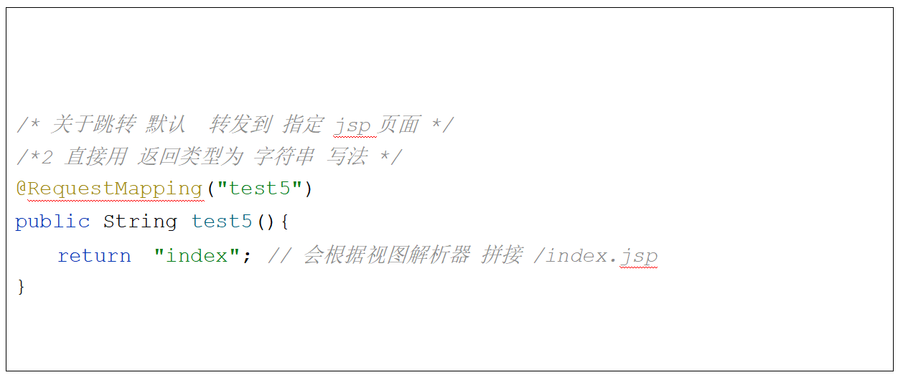
    - 
- 关于 响应参数
    - 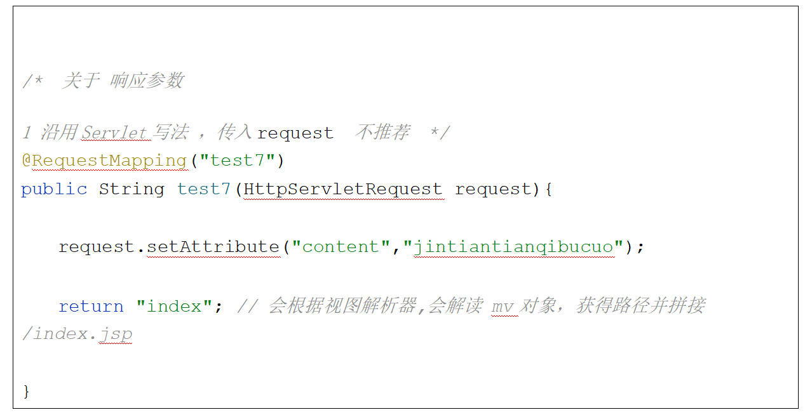
    - 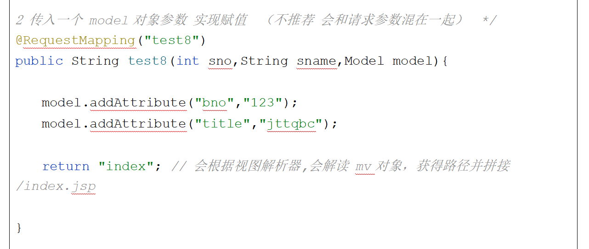
    - 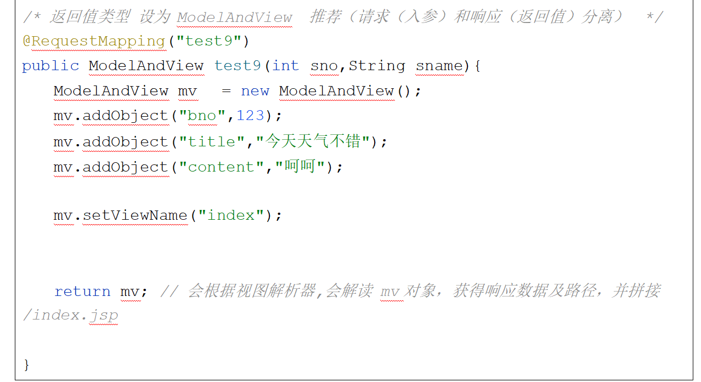

### 截图寄存处

### 报错处理

- 某些版本不支持 *.do
    - 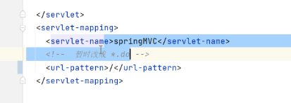
    - 解决方案
      - 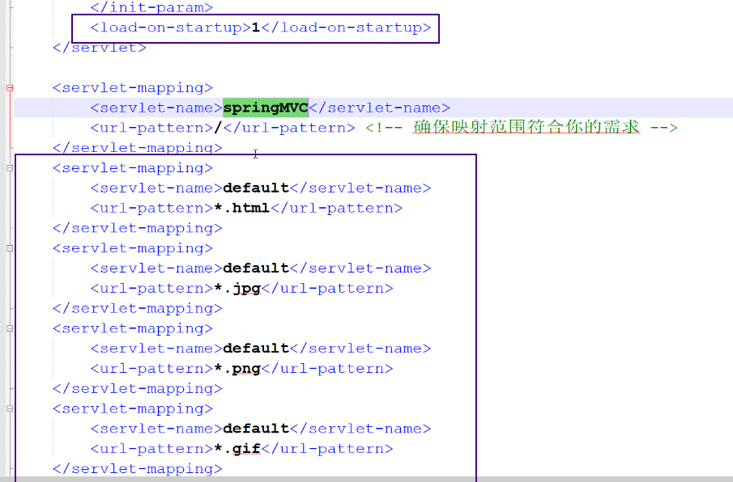
      - 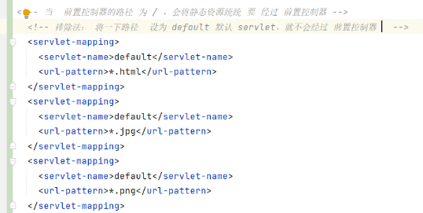