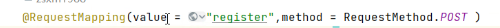
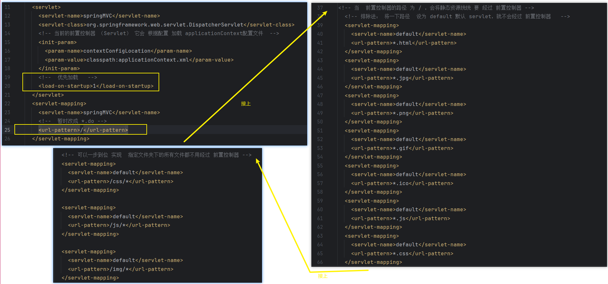

# Note 240806

## Review

### SpringMVC

- 请求参数 的三种方式
    - 
    - 
    - 
- 跳转页面 的方式
    - 默认
        - 这种方法转发到指定的jsp页面（会经过视图解析器） , 不会经过 controller
        - 
        - 
        - 
    - 转发 或 重定向
        - 不会经过视图解析器 ，所以需要写全路径
        - 应用场景:
            - 要 跳转到 其他 控制层的方法
                - 登录后（student/login），直接查看全部(sutdent/queryAllStudent)
            - 要求，直接重定向到 某个页面
                - 注册后，直接 重定向到 首页 或者 登录界面
        - 方式:
            - 和 Servlet一样，传入 request 和response ,使用他们进行转发 或重定向（略）
            - 在 setViewName(”前缀:xxxx路径“)
                - 重定向 ：redirect redirect:../main.jsp  (注意 全路径 )
                - 转发： forward forward:.../main.jsp

- 关于 将数据保存到 request 或 session
  - 如果是 给 model(例如:`mv.addObject("msg","test12的数据");`) 直接设值，默认在requset范围内的
  - 解决方案 三种
      * 1 通过  参数 传入一个requst 对象 getSession setAttribute (不建议)
      * 2 通过   参数 传入一个 session 对象，setAttribute         (不建议)
      * 3 在 类上面添加一个 注解 @SessionAttributes({"msg","my"}) // 值是可以多个的
          当 以下方法中  model或者 modelAndView 对象中 出现 msg 属性，就会把它的值 拷贝一份到session对象中

- 关于 响应参数
    - 
    - 
    - 

- 请求类型(GET POST) 的设置
    - 

### 截图寄存处

### 报错处理

- 前置控制器 路径 某些版本不支持 *.do
    - 
    - 解决方案
        - 
        - 可以一步到位 实现  指定文件夹下的所有文件都不用经过 前置控制器