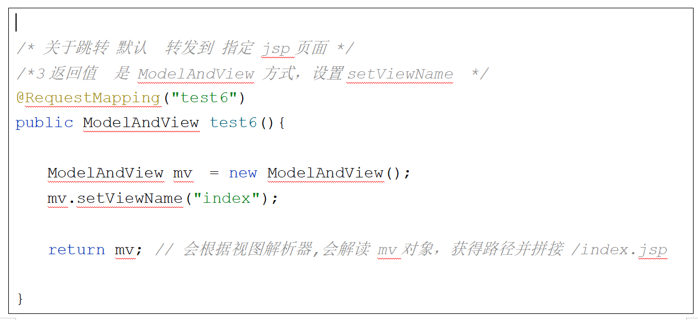
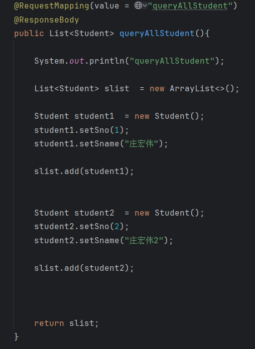

# Note 240806

## Review

## SpringMVC

- 请求参数 的三种方式
    - 
    - 
    - 
    - 几种类型
        * 1 控制层 方法 参数 用 和 请求参数名一致（缺点，要挨个写）
            * 
        * 2 控制层 方法 参数 通过对象接受，要求 属性名 和 请求参数名 一致
            * 
        * 3 在实体类中 涉及到 集合和数组类型属性（元素类型基本数据类型+String） 直接可用（属性名 和 参数名要同名 即使
          一个参数名出现多次）
            * 后端
                * 
            * 前端
                * 
        * 4 直接传递的是数组 ，只要保证 数组名和参数名一致就可以
            * 
        * 5 直接传递的是集合 ，要使用注解 @RequestParam("...") 并 只要保证 数组名和参数名一致就可以
            * 
        * 6 对象中的元素是对象，在前端页面中 属性.属性 方式
          eg User有dog对象作为属性 dog对象 有did 和 dname属性
          前端 name =“dog.did” "dog.dname"
            * 后端
                * 
            * 前端
                * 

        * 7 对象中的元素是集合，集合的元素是其他对象，
          前端 name =“address[0].aid” 代表第一个元素的aid属性值
          name =“address[0].name” 代表第一个元素的name属性值
          以此类推
            * 前端
                * 
            * 后端
                * 
- 跳转页面 的方式
    - 默认
        - 这种方法转发到指定的jsp页面（会经过视图解析器） , 不会经过 controller
        - 
        - 
        - 
    - 转发 或 重定向
        - 不会经过视图解析器 ，所以需要写全路径
        - 应用场景:
            - 要 跳转到 其他 控制层的方法
                - 登录后（student/login），直接查看全部(sutdent/queryAllStudent)
            - 要求，直接重定向到 某个页面
                - 注册后，直接 重定向到 首页 或者 登录界面
        - 方式:
            - 和 Servlet一样，传入 request 和response ,使用他们进行转发 或重定向（略）
            - 在 setViewName(”前缀:xxxx路径“)
                - 重定向 ：redirect redirect:../main.jsp  (注意 全路径 )
                - 转发： forward forward:.../main.jsp

- 关于 将数据保存到 request 或 session
    - 如果是 给 model(例如:`mv.addObject("msg","test12的数据");`) 直接设值，默认在requset范围内的
    - 解决方案 三种
        * 1 通过 参数 传入一个requst 对象 getSession setAttribute (不建议)
        * 2 通过 参数 传入一个 session 对象，setAttribute         (不建议)
        * 3 在 类上面添加一个 注解 @SessionAttributes({"msg","my"}) // 值是可以多个的
          当 以下方法中 model或者 modelAndView 对象中 出现 msg 属性，就会把它的值 拷贝一份到session对象中

- 关于 响应参数
    - 
    - 
    - 

- 请求类型(GET POST) 的设置
    - 

### ajax

- dataType:"text"
    - 后端
        - `@ResponseBody`
            - 加入 ResponseBody 响应体 返回的数据，不再是 jsp页面路径 而是 响应数据
        - 
    - 前端
        - 
- dataType:"json"
    - 后端
        - 导 jQuery.js 文件
            - 
        - 加依赖
            - 
        - applicationContext.xml 加配置
            - 
        - 源码
            - `@ResponseBody`
                - 加入 ResponseBody 响应体 返回的数据，不再是 jsp页面路径 而是 响应数据
            - 
            - 
    - 前端
        - 
        - 

### 截图寄存处

### 报错处理

- 前置控制器 路径 某些版本不支持 *.do
    - 
    - 解决方案
        - 
        - 可以一步到位 实现 指定文件夹下的所有文件都不用经过 前置控制器
- ajax 中文乱码问题
    - 