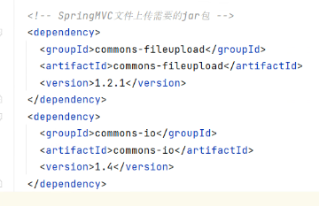
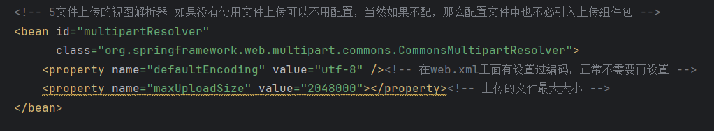
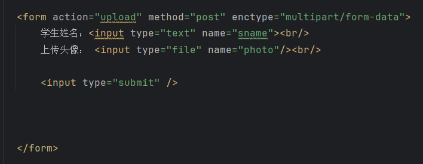
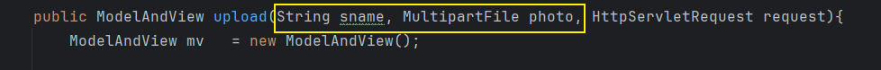
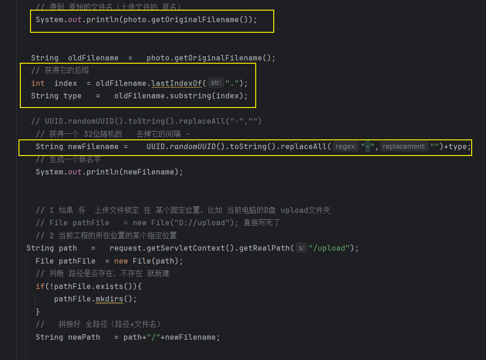
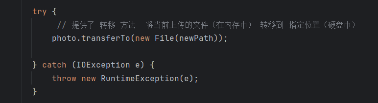
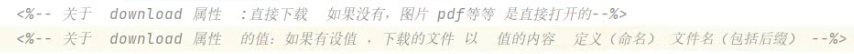
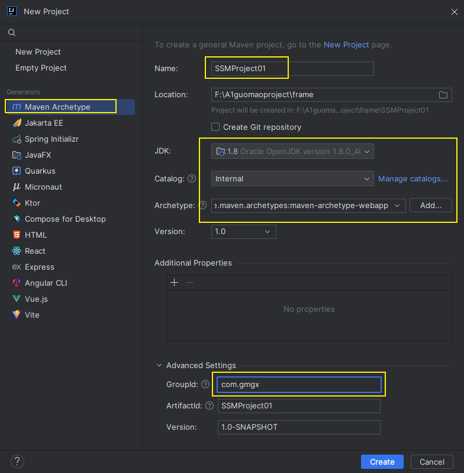
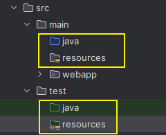

# Note 240807

## Review

- 确认弹出框
    - 
- 输入框不可改
    - 

## ajax

- `produces = "text/html;charset=UTF-8" 如果传递 不是text(String) 不要加`
    - 

## 文件上传下载

- 上传
    - 导依赖
        - 
    - applicationContext.xml 加配置 添加文件的限制（中文 大小）
        - 
    - 添加 jsp文件 form表单提交 注意 method enctype属性
        - 
    - 控制层：参数为 MultipartFile 参数，注意 参数名 和 标签name一致
        - 
    - 主要方法： getOriginalFilename 获得原始名 transferTo 转存到本地
        - 
        - 
    - ````
      其他
      UUID
      获得真实路径
      获得后缀
      创建文件夹等等

- 下载
    - 在 `<a>` 里面加个 download
        - 

## SSM

- 创建项目
    - 
- 调整 项目 目录结构
    - 
- 导依赖
- 在 resources 中创建 applicationContext.xml 文件
    - 不扫描 控制层
- 配置 jdbc.properties (resources 文件夹下)
- 配置 web.xml
- 配置 springmvc-servlet.xml (resources 文件夹下)
    - 扫描控制层
- 配置 log4j.properties (resources 文件夹下)
- resources 文件夹下 创建 mapper 文件夹
- 创建 各级文件夹

### 报错处理

### 截图寄存处

