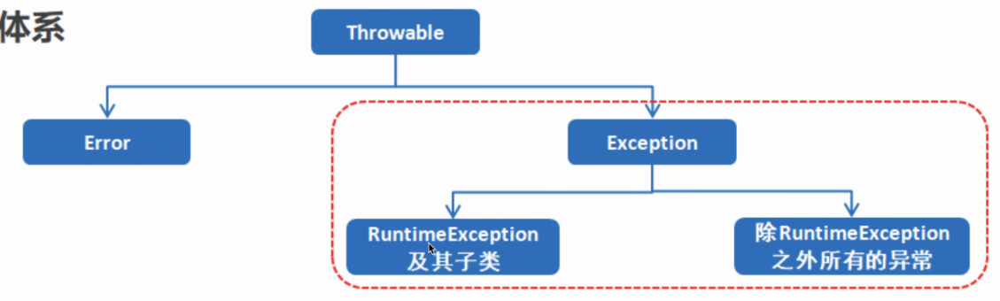
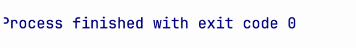
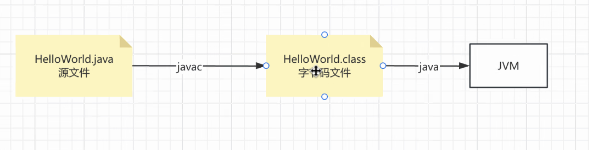
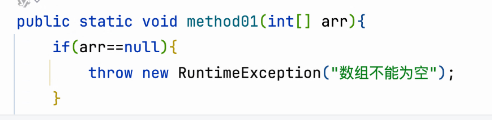
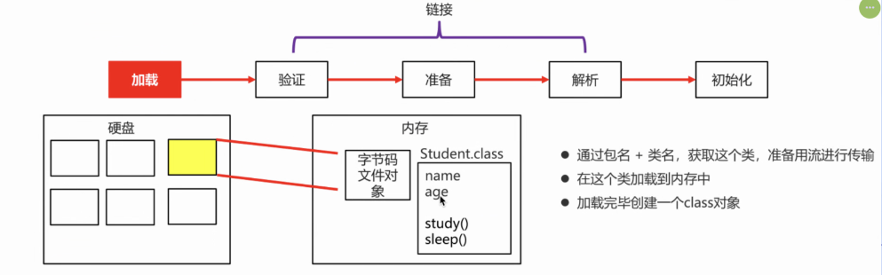
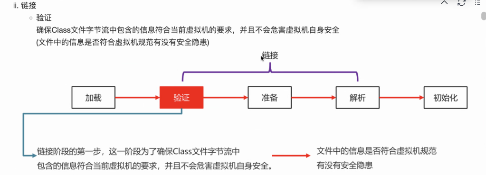
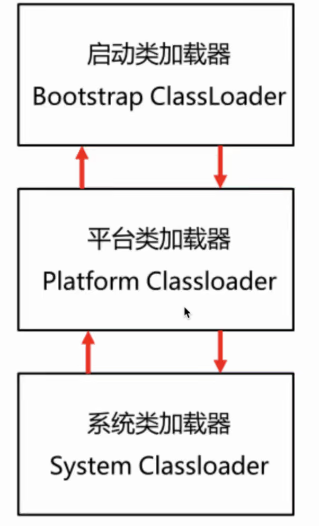

# Note 240728
## Review
- main() 是 JVM 调用的
- String 类 是被 finally 修饰过
### 异常
- 异常的体系
  - 
##### Error 和 Exception 的区别
- Error 错误 , 不可使用代码修复
- Exception 异常 , 可以用代码修复

##### Exception
- RuntimeException 子类
  - NullPiontException 空指针异常
  - ArithmeticException 算术异常
  - ArrayIndexOutOfBoundsException 下标越界异常
  - 受检异常 和 非受检异常
    - 编译期间就需要处理的就是受检异常

##### 异常处理方式
- 默认处理
  - 抛出异常信息
- 自行处理
  - throws 和 throw 有什么区别
- 代码正常运行结束
  - 
- 代码因为异常 被迫退出
  - 
##### try catch finally
- try 和 catch 里的 return 先被 挂起 , 如果  finally 有 return ,

##### 自定义异常

## 代码执行过程
- 
- class 字节码 只加载一次 

## 反射
### 截图寄存处
- 
- 
- 
- 4
  - 
  - 
  - 双亲委派
    - 
- Declared
  - 
- 反射 的 效率比较低