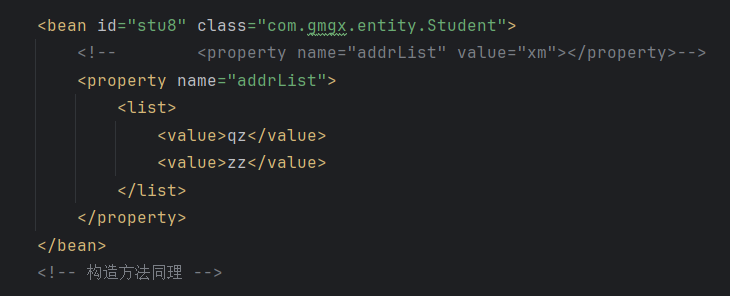

# Note 240801
## Review

## Spring
### Spring 两大核心技术
- IOC 控制反转
  - ````
    控制反转是指将对象的创建和依赖管理交给 Spring 容器来处理。开发者不再负责直接创建对象和处理依赖关系，而是通过配置或注解告诉 Spring 容器如何管理这些对象。
    IoC 的工作流程

    1.配置 Spring 容器：你需要通过 XML 配置文件、Java 配置类或注解来定义 Spring 容器的设置，包括 Bean 的定义和它们的依赖关系。

    2.创建 Spring 容器：Spring 容器会读取配置，并根据定义创建和初始化 Bean 实例。

    3.依赖注入：Spring 容器会根据 Bean 的定义将所需的依赖注入到 Bean 中。这可以通过构造器、setter 方法或直接字段注入来完成。

    4.使用 Bean：一旦 Bean 被创建和依赖注入完成，应用程序可以从 Spring 容器中获取这些 Bean 并使用它们。

    5.容器管理：Spring 容器会负责 Bean 的生命周期管理，包括创建、初始化、销毁等。
- AOP 面向切片
  - ``````
    Spring AOP（Aspect-Oriented Programming，面向切面编程）是 Spring 框架中的一个关键特性，用于处理跨越多个模块的关注点，例如事务管理、日志记录、安全性等。这些关注点通常会与业务逻辑交织在一起，导致代码难以维护和扩展。Spring AOP 通过分离这些关注点，使得代码更加模块化和可维护。
    
    主要概念
    1.切面（Aspect）:
      切面是 AOP 的核心概念，它定义了横切关注点的实现。一个切面是一个普通的类，使用特定的注解或 XML 配置来标识。切面包含了切点和通知的逻辑。
          切点（Join Point）：程序执行过程中的一个点，比如方法调用、对象创建等。在 Spring AOP 中，切点通常指方法执行的位置。
          通知（Advice）：切面中定义的具体操作，它在切点处执行。Spring AOP 支持不同类型的通知：
              前置通知（Before Advice）：在切点方法执行之前执行。
              后置通知（After Advice）：在切点方法执行之后执行，无论方法是否抛出异常。
              返回通知（After Returning Advice）：在切点方法正常执行结束后执行。
              异常通知（After Throwing Advice）：在切点方法抛出异常时执行。
              环绕通知（Around Advice）：在切点方法执行之前和之后都可以执行，能够控制切点方法的执行。

    2.切点表达式（Pointcut Expression）

      切点表达式用于定义哪些方法需要应用切面中的通知。它是通过表达式语言来描述的，通常包括方法名称、方法参数和包路径等。

    3.织入（Weaving）
  
      织入是将切面应用到目标对象的过程。织入可以在不同的时间点发生：
          编译时织入：通过编译器将切面织入到代码中。
          类加载时织入：通过类加载器在类加载过程中织入切面。
          运行时织入：在运行时通过代理技术将切面织入到目标对象中，这是 Spring AOP 默认的织入方式。

### 功能
- IOC 控制反转
- AOP 面向切片
- 事务管理
  - ``````
    Spring 事务管理是 Spring 框架提供的一个重要特性，用于处理数据库事务，确保数据的一致性和完整性。事务管理帮助开发者通过一致的编程模型来处理事务，无论是使用 JDBC、JPA、Hibernate 还是其他持久化技术。
    
    事务的基本概念:

    1.事务（Transaction）

      事务是一个操作的集合，这些操作要么全部成功，要么全部失败。事务具有以下四个特性（ACID）：
          原子性（Atomicity）：事务中的所有操作要么全部成功，要么全部失败，不会停留在中间状态。
          一致性（Consistency）：事务执行前后，数据库都处于一致的状态。
          隔离性（Isolation）：并发事务之间的操作互不干扰，每个事务都应该独立执行。
          持久性（Durability）：事务一旦提交，所做的修改将永久保存在数据库中。

    2.事务管理
  
      事务管理是指在应用程序中管理事务的创建、提交和回滚。Spring 提供了灵活的事务管理机制，支持声明式事务管理和编程式事务管理。
    
- 整合其他框架

## 创建 Spring
- ### 依赖
  - 
  - 在 pom.xml 中
    - 要在 properties 中 统一 Spring 的版本
    - 
- ### applicationContext.xml
  - 
  - 定义一个实体类
  - 加载配置
    - 

- ##### applicationContext.xml 里的配置
  - 
  - 单例
    - singleton 单例（默认）   当前 spring容器（专属空间） 只有一个实例化对象
  - 原型
    - prototype 原型 : 可以通过多次 调用 getBean 获得多个对象
  - 初始化方法
    - `init-method="initMethod"`
  - 销毁方法
    - `destroy-method="destroyMethod"`
    - 什么时候销毁 : ( 单例模式下 )上下文对象关闭即销毁
      - 
- ##### 单例 和 原型 的区别
  - 
- ##### 注入 (赋值) 方式
  - setter 方式
    - 
  - 构造器 方式
    - 
  - 数组 注入
    - set 方式
      - 
    - 构造 方式
      - 
  - 集合 List 注入
    - 
  - 集合 Map 注入
    - 
  - 一对一 关系的注入
    - 
  - 一对多 关系的注入
    - 


## 课外
- 定位 要明了 (知止而后有定) we creat objects to solve complex problem
- 物物不以物于物 (学习上也是)