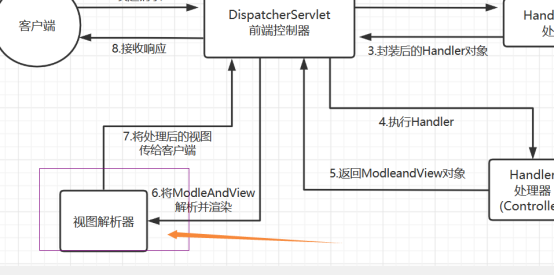

# Note 240802
## Review

## 工厂类
- 创建对象的方法
  - 静态方法
    - 
  - 普通方法
    - 
  - 按需加载
    - 只有在使用 `applicationContext.getBean()` 才调用构造函数
      - 
  - 预加载
    - 单例模式（整个Spring容器中 有且仅有一份 默认 在 配置加载后（applicaitonContext对象创建的时候））被创建
      - 

### 自动注入 
- autowire=""
  - byName
    - 
  - byType
    - 

### 通过 扫描 + 注解 
- 传统
  - 
- 通过 注解 + 扫描
  - 在 applicationContext.xml 里
    - 
    - 
- 主键扫描
  - 
- 注解 
  - 
    - 有四个: (写在类上面)
    - 控制层 @Controller
    - 业务逻辑层 @Service
    - 数据访问层 @Repository
    - 其他层(工具类) @Component
  - 自动注入
    - @Resource (可以不用写 get set 方法) 通过 反射实现的  

- 通过扫描+注解的方式 取代了原来的逐个 配置bean标签方式，更加简便
  - 如何获得 Bean 对象 
    - 如何获得这个bean ，getBean
      - 1 没有其他配置；默认  类名首字母小写
        - 
      - 2 如果在@Controller(“名字”) 通过 名字
        - 
      - 3 直接用类名.class 的方式获得（推荐）
        - 
      

- 传统 与 注解+扫描的方式 的区别
  - ``````
    普通写法（配置bean标签）和注解+扫描写法的对比
    1.普通写法 每个类都要在xml中配置一个 bean标签
      新的写法 只要在xml中添加对应的依赖（.xsd 等）以及加入扫描标签即可，
      并且要在类上方写上对应的注解（
      四个注解：
        控制层 @Controller
        业务逻辑层 @Service
        数据访问层 @Repository
        其他层（比如 工具类等等）  @Component
      ）
      （一劳永逸）
    2 普通写法：存在属性注入的时候，属性需要提供set方法
      新的写法：存在属性注入的时候，属性不用提供set方法（系统通过反射获得）
    3 普通写法，要在bean中配置 ref或者 通过 autowire="byType"自动注入
      新的写法：不用修改xml文件，只需要再对应的属性上方写上@Resource
          
- ``````
  关于使用注解版的 自动注入 注意实现：
  一、 如果只存在一个对应类型的实现类，直接用即可（相当于是 之前设置的 byType）
  二、 如果存在 多个 同类型的实现类：怎么区分？
  1 通过 通过属性名来判定（ 属性名等于 对应 实现类的首字母小写 方式 ） 缺点：一处修改，处处修改
  2 在@Resource后面加个属性：name值 等于 对应 实现类的首字母小写
  缺点：如果当前方法是我写的，实现类是别人写的，我不能因为别人的修改，一直我的代码
  3 修改实现类上的注解 比如 ：@Service("名字") 名字 和我的属性名同名，则使用该 实现类（注入该实现类的对象）（推荐）


### SpringMVC
- 创建SpringMVC
  - 创建项目
    - 
  - 导入 依赖
    - 
    - 
  - 配置 applicationContext.xml
    - 
  - 修改配置 web.xml
    - 
- 流程图
  - 

- 控制层
  - ``````
    在controller包下，创建一个普通的类：
    运用Spring中的知识，我们可以在这里配上 @Controller注解
    这样就可以被 前置控制器识别到（确切的来说是 处理器映射 到）
    
  - 
  - 
- 关于返回页面
  - 有两种写法：
    - 方式一
      - 一种是直接返回字符串：SpringMVC 会识别到 这个一个路径，然后调用 视图解析器 找到对应的jsp页面
        - 
      - 字符串只需要写 jsp文件名，不用写后缀，后缀由视图解析器帮你拼接
        - 
      - 代码如下
        - 
    - 方式二 (推荐)
      - 
      - 关于 获得 参数（前端发送到控制层的数据：）
        - 
      - 响应数据（传值到jsp页面中显示）：
        - 
      - 前端页面的获得和请求同 jspServlet一样
        

### 报错
- 空 Bean 报错
  - 
- 在 Spring 版本为 6.1.10 下的报错
  - 
- 