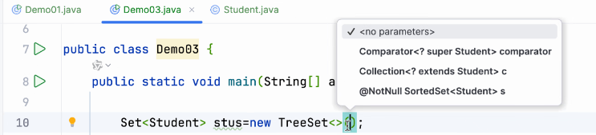
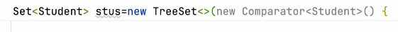
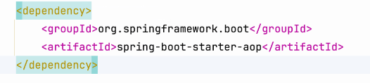
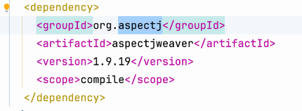

# note 240804

## 集合
- Set 
  - 是个 接口 , 继承 
  - 存储 是无序的
  - 不会存储 重复的
  - Hashset
    - String int 类型 是能自动判断是否 重复
    - 其他不行
  - 能排序的 Set
    - TreeSet
      - 自带 自然排序(数字 , 字符串)
      - 自定义排序 
        - 要 实现一个接口 Comparable
        - 在 new TreeSet(这里 传一个比较器) 
          - 
          - 
- object 的 equals() 比的是地址值

## AOP
- 导依赖
  - 
- 实现是第三方实现
  - 
- 应用
  - 控制权限
    - 类似于过滤器的功能
  - 记录日志
    - 
- 切 方法
- 切 注解